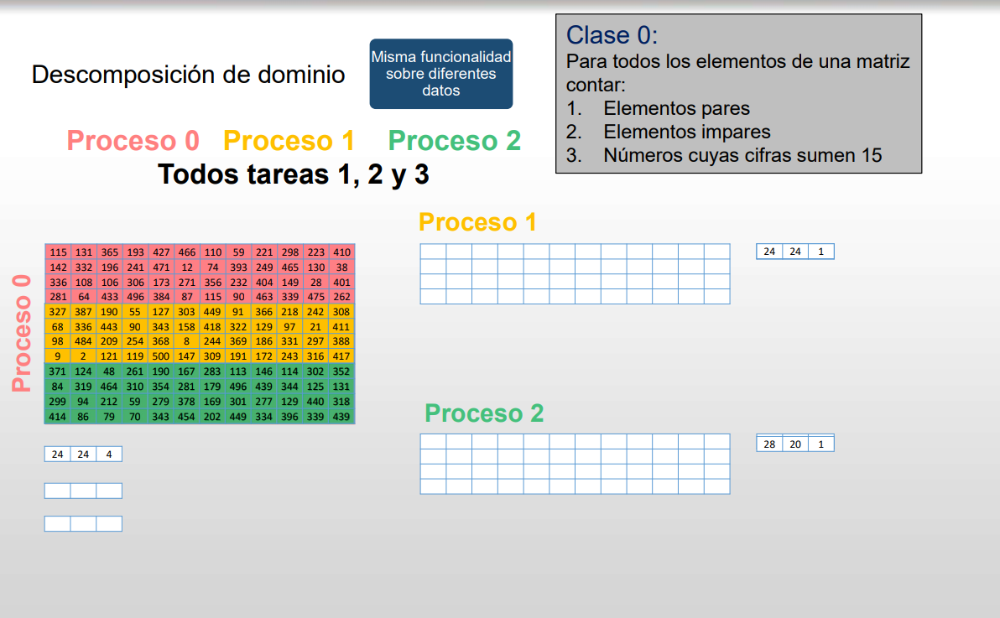

# Arquitecturas de memoria distribuida: MPI

En SO se ven codigos que se crean hilos de sistemas operativos. Esos hilos son capaces de comunicarse. La computación paralela me sirve para facilitar el desarrollo de códigos. Otro ejemplo para ver cuanto la computación paralela puede facilitar el desarrollo de código son los hilos.

Que coste tiene cada uno de los hilos y donde los mapeo?

Los hilos tienen un objetivo común: aplicación que genera x acciones.

La comunicación entre los hilos, por el concepto del paralelismo, es imprescindible.

Ejemplo 1K sumas. Un hilo 500 y el otro hilo 500. Cuando gestionamos la sincronización? Cuando termine la suma de los hilos individuales, es decir, cuando estamos seguros de que ha acabado su trabajo.

Las sincronizaciones estarán siempre vinculadas a comunicaciones, es decir, las comunicaciones son el punto de sincronización.

El objetivo del reparto de trabajo es acelerar el trabajo. Cuando hacemos el reparto de trabajo, debemos de tener algo claro y es que el resultado en secuencial verificado debe ser exactamente igual al resultado en paralelo.

> MPI está orientado a arquitecturas de memoria distribuida, pero funciona en arquitecturas de memoria compartida.

## Arquitectura de memoria distribuida

Diferentes elementos de computo que se interconectan a través de la misma red de interconexión.

Las comunicaciones se tienen que gestionar. Tenemos que ir intuyendo que otras cosas tenemos que envíar.

Siempre habrá 1 elemento de computo que gestionará el software paralelo y tendrá que comunicarla información al resto de elementos de computo.

Únicamente desarrollaremos en esta asignatura 1 solo código, es decir un solo compilar.

Y será independientemente del tamaño del problema a resolver.

Ese compilado hará casi lo mismo en todos los computadores.

Para explotar el paralelismo de arquitecturas de memoria distribuida tenemos varios modelos:
* Paso de mensajes: el que vamos a utilizar en MPI
* Datos paralelos
* Plataformas o liberías que simulan memoria compartida (si simula memoria compartida es porque desarrollar para memoria compartida es más fácil? -> es más rápido. el motivo por que aprendemos mpi primero, es porque en mpi tenemos que saber todo lo que está pasando: puntos de distribución, reparto de trabajo, etc.)
* Podríamos utilizar comunicaciones a más bajo nivel TCP, UDP, ...? -> si

Lógicamente distribuida y físicamente distribuida.

## Otros Modelos

### Datos Paralelos

Solo a aplicaciones que se centran en operaciones de conjuntos de datos. Tiene que ser que mi aplicación esté destinada al procesamiento de datos y que tengamos estructuras que puedan explotar estos modelos. Van a ser muchos de los ejemplos que se verán en pasos de mensajes.

Cada proceso trabajará sobre un conjunto de datos, pero la diferencia es que aquí cada tarea va a realizar la misma operación a su sección de datos, si o si.

El modelo de datos paralelos no es exclusivo en arquitecturas de memoria distribuida. Las comounicaciones cuando trabajo en memoria compartida las comunicaciones se realizan a través de la memoria global.

En memoria distribuida cada computador tiene que almacenar en su memoria los datos con los que va a trabajar.

Se trabaja con las estructuras de datos paralelas se utilizan liberías o directivas como HPF (hyper no se que fortran). Hay lenguajes computacionalmente más eficientes que C sin llegar a ensamblador, como fortran.

### Librerías uso en arquitecturas de memorias distribuida sin comunicaciones explicitas

Podemos suponer que en una memoria distribuida con 4 procesos, cada uno tiene 64 GB, podríamos considerarlo como una sola de 64x4, donde el desarrollador solo controla el acceso a memoria. 

Modelamos como un espacio de memoria único. El objetivo normalmente es abstraer a arquitectura híbrida (DM + SM).

El más utilizado UPC, peor hay varias alternativas disponibles. Esto depende del administrador de sistema, HPC, instala este tipo de recursos.

Cuando accedo a una variable, no sé en que memoria de que proceso está. Que pasa si accedo a una variable que no está en mi memoria? Pues que esa librería que tengo que me abstrae el sistema, se encarga de solicitar la comunicación para traer el dato de la otra memoria a donde estamos, es decir, establece una comunicación.

El acceso se ha encarecido mucho. Yo sé cuando se produce eso? No. Porque tengo abstraido ese mapa de memoria.

Como balanceo la carga si no tengo claro que la ejecución vaya a ser más o menos similar en función del trabajo.

Sabiendo esto, sabemos que para nosotros este modelo no será óptimo.

En este modelo, es físicamente distribuida pero lógicamente es solo una.

Aquí, si accedo a una posición que está en otra zona física tardará más que si está en la misma.

### Podríamos utilizar herramientas de más o menos nivel?

* S.O -> hilos, thread placement in OpenMP, podemos decidir en que core del sistema se ejecutará cada hilo. (Lo que se ve en la asignatura está un poco por encima de esto, pero lo usamos practicamente al mismo nivel)
* Protocolos de comunicación TCP, UDP -> Se tienen que controlar las comunicaciones
* OpenCL

# Porque MPI -> Message Passing Interface
Estándar de facto para arquitecturas de memoria distribuida, es decir, no hay un organismo detrás y es una herramienta que se utiliza mayoritariamente por la comunidad.

En cuanto al rendimiento, se consigue un buen rendimiento al ocultarle al usuario las características propias de la red. Es decir, facilita mucho el desarrollo.

Además, es escalable (como se comporta el sistema paralelo a medida que aumentan la cantidad de recursos utilizados). Como se comporta cualquier cosa cuando aumento las prestaciones o las demandas del sistema. Depende de grupos y comunicaciones colectivas.

> Cuando necesito mas como se comporta?

> Ejemplo: Red de barras cruzadas. El sistema con esta red es mas escalable o menos que una gigabit ethernet? Es menos escalable. Porque la red es muy compleja y admite un X numero de nodos conectados. Gigabit ethernet permite cientos de decenas de dispositivos conectados en la red propia. Esa red, es mas escalable que la red de barras cruzadas en un sistema hpc. Porque admite mas conexiones sin degradar las prestaciones.

Un sistema paralelo lo es todo:
* hardware
* software
* herramientas que utilizo

MPI también es formal, es decir,el comprotamiento es completamente definido, con lo cual se podrá trasladar a otro sistema.

Es seguro, las comunicaciones se llevan a cabo si o si. No pienso si se hacen o no. No pienso que el mal funcionamiento es debido a un problema en la comunicación. Codifico una función de envio y sé que ese envio se ha realizado. No se hace el control de errores.

Si se cae un computador NO me recupero. Como no me puedo recuperar, mi ejecución no habrá terminado correctamente, MPI lo detectará y abortará y lo tendrá que solventar el administrador del equipo. Si ha pasado eso, se aborta, se arregla el sistema y se vuelve arrancar.

Los lenguajes son: C, Fortran y Python.

## Implementaciones de MPI (libres)
* MPICH
* LAM/MPI
* OpenMPI
* MPI-MS (.NET)
* ...

## MPI está enfocado a arquitecturas de memoria distribuidas en las cuales (pensamos en computadores distintos con la misma red de interconexión):

Disponemos de un conjunto de procesadores con su propia memoria (distintos computadores con una misma red de interconexión)

Desarrollamos un único código con un solo compilado. Será este el que lanzamos en todos los procesos. Yo sé que puedo solicitarle al SO que me ejecute una cosa. Si tengo una ejecución con MPI, tendré que ejecutarlo en todos.

> El compilado es el mismo para todos, pero no hará lo mismo en todos.

Un proceso se ejecuta en un procesador. Un procesador debe ejecutar un solo proceso. Pensamos esto así.

Cuando MPI haya lanzado todos esos procesos y MPI me diga que son capaces de interocmunicarse a travez de la red d einterconexión, ya podrá pensar en que pueden intercambiar información. Las comunicaciones las veo, son instrucciones que se ejecutan.

> Sabemos que son hibridos y que en cada nodo hay muchos cores. Los cores, la potencia del computo que proporciona, se explotará con OpenMP si es necesario, pero no con MPI.

Las comunicaciones en MPI me sirven para intercambiar datos y para realizar las sincronizaciones.

## Modelo de MPI

Cada una de las tareas tiene su propio mapa de memoria.

> Donde residen los datos que procesamos? Estos residen en la memoria. Yo empiezo a contar mi trabajo de paralelización cuando tengo mis datos en memoria. De donde provienen? Puedo acelerar como vienen? De estas dos cosas no me preocupo en esta asignatura. Los datos a procesar estan en memoria si o si.

Que es un puntero? Una dirección de memoria. Cuando desarrollemos en MPI paracerá lo mismo, si hablamos de dos procesos, pero no lo será. Da igual que tenga el mismo nombre de variable. Será un puntero, dirección de memoria, distinta.

Los datos se intercambian enviando y recibiendo mensajes.

> Los mensjaes comunican datos, y estos se guardan en memoria. **Un mensaje es un conjunto de datos que estan contiguos en memoria.**
> En un modelo como MPI no se pierden los datos. Da igual cuando se realice la comunicación, si se hace un envio la comunicación se hará. Siempre yc uando el mensaje sea el mismo, es decir, si enviamos 100 enteros, el receptor epsera esos 100 enteros.

El intercambio de datos normalmente requiere trabajo cooperativo (intervienen emisor y receptor). No será a la misma vez. Si yo quiero realizar una comunicación tendremos, emisor, receptor, canal y mensaje. Yo tengo que enviar y el tiene que recibir. Esto es desde el punto de vista del código.

> Que pasa si están haciendo otra cosa? (emisor o receptor) Se esperan.

### Intercambio de datos puede ser:

* Cooperativo: intevienen todos los elementos en el proceso del intercambio de datos.
* One sided (MPI-2): solo interviene uno de los dos en la comunicación (emisor, receptor)
    Se produce la comunicación, en el código no veo la función de recepción, existe todo, pero no vemos la función de sincronización ni la participación de ambas partes.

En una comunicación puede haber más de un emisor? Si pueden haberlo pero eso ocasiona un problema y el sistema se tendría que encargar de solucionar eso, es decir no es ideal.

En una comunicación puede haber más de un receptor? Si, todos los que uno quiera.

### Diferencia entre MPI 1 y MPI-OneSided 

MPI 1 se tiene que esperar a que el receptor esté list. MPI One sided no se espera. Simplemente envía. No sabemos que está ejecutando el otro proceos porque no lo vamos a utilizar (el proceso actual).

En One-Sided solo veo la instrucción de comunicación en uno de ellos, por lo que no intervenimos los dos en la comunicación. 

Como se que la comunicación se ha llevado a cabo? Hay mecanismos para poder recuperar la sincronización en una comunicación one-sided. 

> Esto no lo vamos a ver a nivel de código

# Diseño paralelo

Decidimos lo que hacer en código. 

* Cómo reparto del trabajo?
* Cómo realizo la sincronización?
* Hay dependencias?

Cuando yo hago un diseño paralelo, de ese diseño que yo he hecho, tiene que provenir las cosas que tengo que codificar.
Tengo que saber que cosas tengo que codificar, o conocer lo que vamos a llamar el patrón de comunicaciones.

* Cuantas comunicaciones
* De que proceso a que proceso

De mi diseño paralelo viene el patrón de comunicaciones y del patrón de comunicaciones viene la reserva de memoria, es decir, memoria dinámica.

Del patrón de comunicación, viene directamente pero no inferido, la reserva de memoria que es un grupo de recursos que depende del tamaño del problema.

# Descomposición de dominio

hay varias opciones para repartirlo:

* bloques por filas
* bloques por columnas
* ciclico, por fila
* ciclico, por bloques

todas son posible por el punto de vista de balanceo de carga.

sin embargo, la complejidad de la gestión varía.

Ciclica 2D es la estructura de distribución que se utiliza en librerías de altas prestaciones en álgebra.

En el caso del reparto por bloques, existe la posibilidad de que la carga no esté balanceada por la naturaleza de los datos.
Dependiendo del algoritmo de los sistemas de descomposición, se puede relizar un desbalanceo de carga por la naturaleza de los datos.

Ahora mismo nos interesa buscar una forma de repartir el trabajo y acelerar el coste computacional:

Si somos 3 procesos, somos: p0, p1, p2

Si somos 5 procesos, somos: p0, p1, p2, p3, p4

El proceso 0 siempre exste. Por eso el proceso p0 será el que accede al fichero. Será el que obtiene los datos y el que realiza toda esa gestión.

Siempre que el proceso 0

Cuando ya tenga enviado el patrón de comunicaciones...

Ley de Amdhal, siempre hay cosas que tenga que hacer en secuencial, habrá cosas que impedirán que el speed up sea monotonamente creciente.

En el momento en el que cada uno tenga sus datos, ya se podrá empezar a trabajar

Lo que sumen esas cantidades es el resultado que yo busco. Como lo obtengo si está cada uno en un computador distinto?
Tengo otro proceso de comunicación donde el proceso 1 envía la comunicación al 0 y el proceso 2 al 0. 
Por lo tanto, comunicamos resultados y los juntamos en el 0.

Que podría pasar?

La primera, es que yo he recibido información, la proceso y no la guardo.

El proceso 0 necesita guardar toda la información, por lo que el proceso 0 tendrá que hacer una reserva de memoria a corde con el tamaño del problema de todos.

