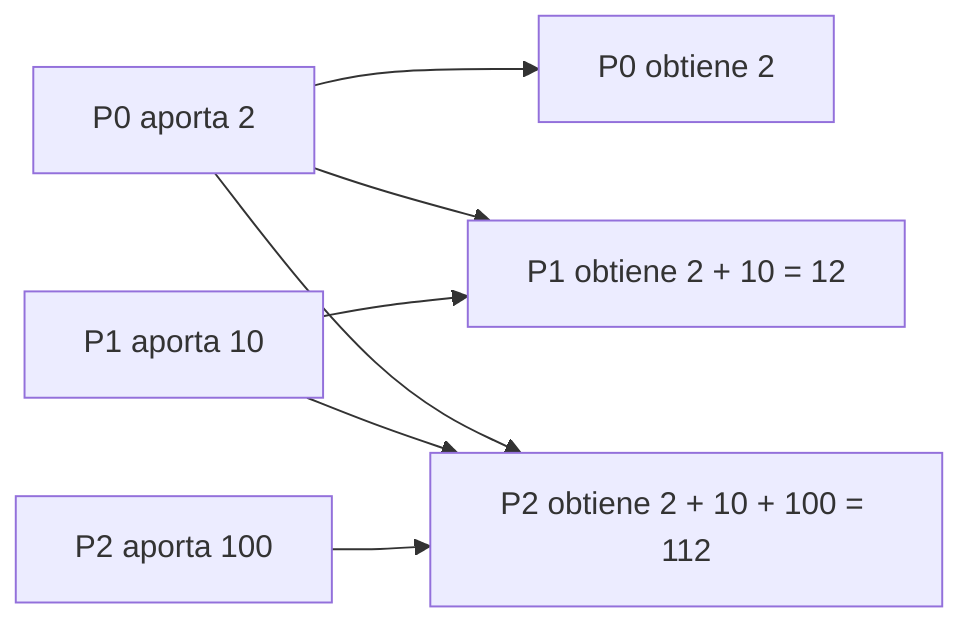
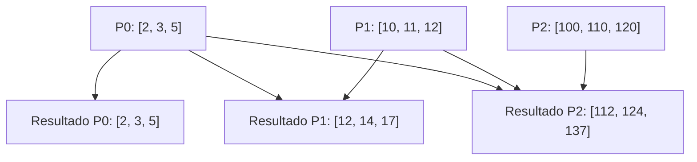
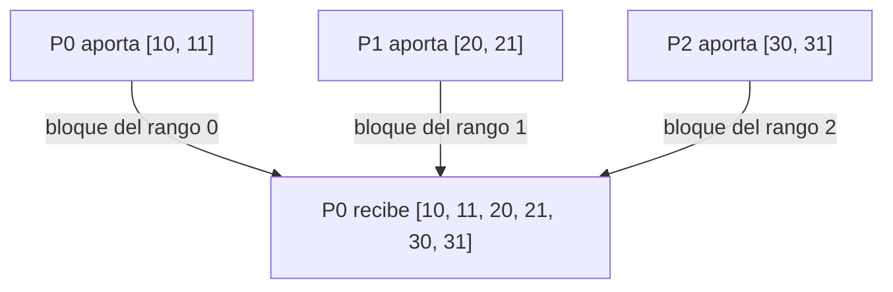
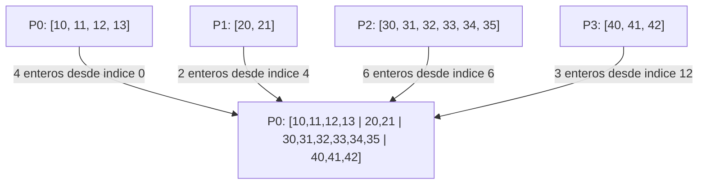
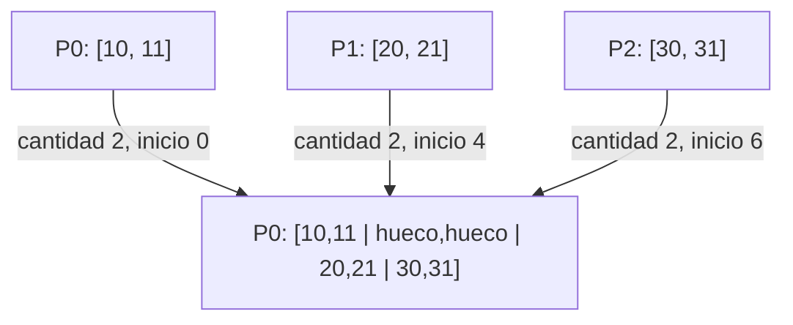
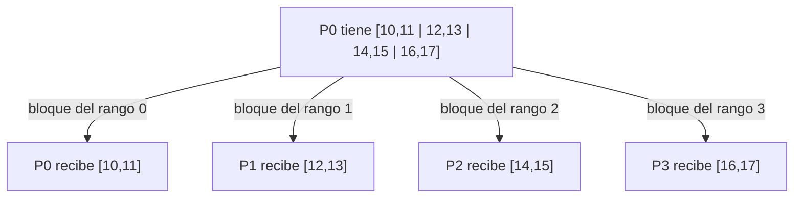
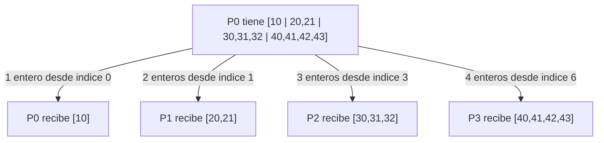
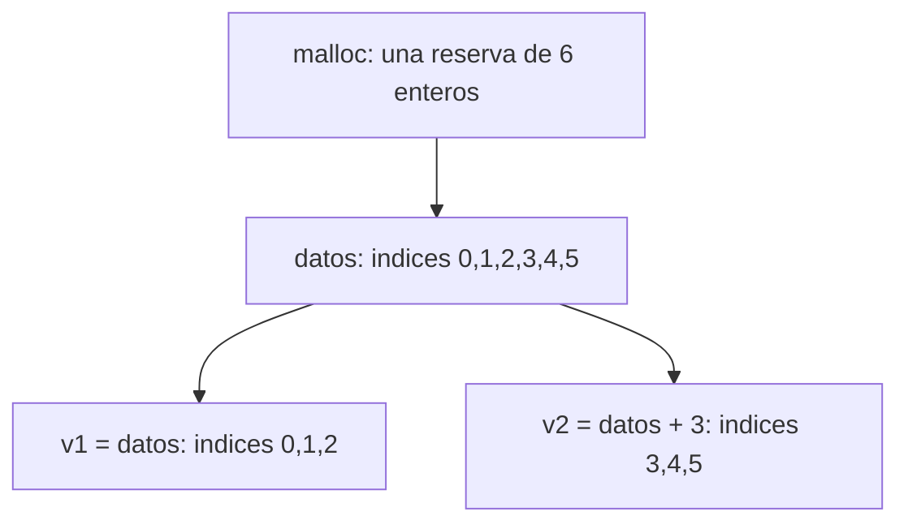
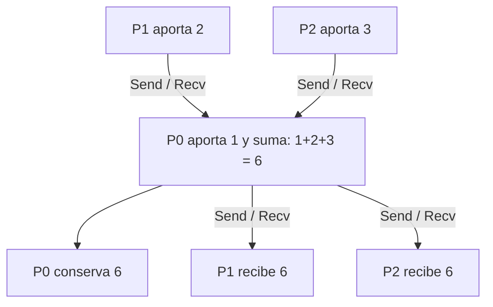

# Clase del 6 de octubre: colectivas y comunicación punto a punto

El objetivo es entender el efecto de cada colectiva y poder construir una implementación concreta con `MPI_Send` y `MPI_Recv`. Por ejemplo, se puede implementar Allreduce recogiendo las aportaciones en P0, reduciéndolas y enviando el resultado a todos.

Los diagramas muestran resultados o algoritmos didácticos. No describen necesariamente el algoritmo interno de una biblioteca MPI. Cada sección indica el número de procesos usado en su ejemplo.

<a id="navegacion"></a>

## Navegación

- [MPI_Scan: reducción acumulada](#mpi_scan)
- [MPI_Gather: bloques iguales](#mpi_gather)
- [MPI_Gatherv: bloques variables](#mpi_gatherv)
- [MPI_Scatter: repartir bloques iguales](#mpi_scatter)
- [MPI_Scatterv: repartir bloques variables](#mpi_scatterv)
- [Una reserva para dos vectores](#memoria)
- [Relación con Send y Recv](#punto-a-punto)
- [Referencias](#referencias)

<a id="mpi_scan"></a>

## MPI_Scan: reducción acumulada inclusiva

### Diagrama con tres procesos

Con suma, cada proceso recibe el resultado de combinar las aportaciones desde P0 hasta su propio rango, incluida su aportación.



**Lectura:** P0 obtiene su propio valor; P1 combina P0 y P1; P2 combina P0, P1 y P2.

Todos aportan la misma cantidad de elementos, indicada por `NumDatos`. Lo que aumenta con el rango es el número de aportaciones combinadas: Pi obtiene una reducción de i + 1 aportaciones. No significa que cada proceso deba enviar un vector de tamaño diferente.

### Llamada y ejemplo

```c
err = MPI_Scan(
    Operando, Resultado, NumDatos,
    TipoDatos, Operacion, comunicador
);
```

- `Operando`: dirección del dato o vector local.
- `Resultado`: búfer donde este proceso recibe su prefijo.
- `NumDatos`: elementos aportados por cada proceso.
- `TipoDatos`: tipo de esos elementos.
- `Operacion`: operación de reducción, por ejemplo `MPI_SUM`.
- `comunicador`: grupo de procesos que participa.

Con tres procesos, dentro de un programa que ya ha inicializado MPI y obtenido `rank`:

```c
int aportaciones[3] = {2, 10, 100};
int local = aportaciones[rank];
int prefijo;

MPI_Scan(&local, &prefijo, 1, MPI_INT, MPI_SUM, MPI_COMM_WORLD);
printf("P%d obtiene %d\n", rank, prefijo);
```

P0 obtiene 2, P1 obtiene 12 y P2 obtiene 112. Scan no tiene un parámetro raíz: cada proceso obtiene su resultado.

### Diagrama con vectores

La reducción se hace **elemento a elemento**:



Por ejemplo, la segunda posición de P2 contiene 3 + 11 + 110 = 124. No se suman entre sí las posiciones del mismo vector.

```c
int entradas[3][3] = {
    {2, 3, 5},
    {10, 11, 12},
    {100, 110, 120}
};
int resultado[3];

MPI_Scan(entradas[rank], resultado, 3, MPI_INT, MPI_SUM,
         MPI_COMM_WORLD);
```

**Aclaración sobre los mensajes:** en una implementación en cadena, P0 inicia sin recibir, Pi recibe el prefijo anterior, añade su aportación y lo envía a Pi+1. No es necesario recibir por separado los datos de todos los rangos anteriores. La colectiva garantiza el resultado; no obliga a usar esa cadena.

[Volver a la navegación](#navegacion)

<a id="mpi_gather"></a>

## MPI_Gather: reunir bloques del mismo tamaño

### Diagrama con tres procesos y raíz P0



Gather reúne los datos sin sumarlos ni reducirlos. En el búfer de la raíz, los bloques quedan colocados por rango: primero P0, después P1 y después P2. Los datos de distintos procesos pueden ser iguales; no tienen que ser valores diferentes.

La raíz también llama a Gather y aporta su bloque. En una implementación didáctica con Send/Recv, puede copiar su bloque localmente, sin enviarse un mensaje a sí misma.

### Llamada y ejemplo

```c
err = MPI_Gather(
    DatosEnvio, NumDatosEnvio, TipoDatosEnvio,
    DatosRecepcion, NumDatosRecepcion, TipoDatosRecepcion,
    Raiz, comunicador
);
```

`NumDatosRecepcion` es la cantidad que la raíz recibe **de cada proceso**, no la cantidad total. Si tres procesos aportan diez enteros cada uno, la raíz necesita espacio para treinta, pero ese argumento vale diez.

Con tres procesos y dos enteros por proceso:

```c
int local[2] = {(rank + 1) * 10, (rank + 1) * 10 + 1};
int reunidos[6];

MPI_Gather(local, 2, MPI_INT, reunidos, 2, MPI_INT,
           0, MPI_COMM_WORLD);

if (rank == 0) {
    for (int i = 0; i < 6; i++) printf("%d ", reunidos[i]);
    printf("\n");
}
```

El resultado en P0 es `[10, 11, 20, 21, 30, 31]`. El búfer de recepción solo es significativo en la raíz.

### Orden de llegada y MPI_ANY_SOURCE

El orden final por rango no depende de quién llega antes. Gather coloca los bloques en las posiciones que corresponden a cada proceso; no ordena los valores numéricamente.

En una implementación propia, `MPI_ANY_SOURCE` permite recibir un mensaje de cualquier origen. **No lo coloca automáticamente por rango**: necesitas consultar `status.MPI_SOURCE` y copiarlo en la posición correcta.

Ejemplo de la recogida en P0 para tres procesos:

```c
/* Dentro de la rama rank == 0; local y reunidos son los de arriba. */
reunidos[0] = local[0];
reunidos[1] = local[1];

for (int k = 1; k < 3; k++) {
    int recibido[2];
    MPI_Status status;

    MPI_Recv(recibido, 2, MPI_INT, MPI_ANY_SOURCE, 200,
             MPI_COMM_WORLD, &status);

    int origen = status.MPI_SOURCE;
    reunidos[2 * origen] = recibido[0];
    reunidos[2 * origen + 1] = recibido[1];
}

/* En cada proceso distinto de P0 se ejecutaria:
   MPI_Send(local, 2, MPI_INT, 0, 200, MPI_COMM_WORLD);
*/
```

Esto supone un mensaje por emisor y que no hay mensajes ajenos con esa etiqueta y comunicador. Recibir de cualquier origen puede evitar esperar primero a un proceso concreto, pero no garantiza que siempre sea más rápido.

[Volver a la navegación](#navegacion)

<a id="mpi_gatherv"></a>

## MPI_Gatherv: reunir bloques de tamaños distintos

### Diagrama con cuatro procesos y raíz P0



Gatherv permite que cada proceso aporte una cantidad diferente y que la raíz elija dónde guardar cada bloque. Usa dos tablas con una entrada por proceso:

| Rango | NumDatosRecepcion | Desplazamientos | Posiciones ocupadas |
|---|---:|---:|---|
| P0 | 4 | 0 | 0–3 |
| P1 | 2 | 4 | 4–5 |
| P2 | 6 | 6 | 6–11 |
| P3 | 3 | 12 | 12–14 |

```c
int cantidades[4] = {4, 2, 6, 3};
int desplazamientos[4] = {0, 4, 6, 12};
```

Estas tablas son significativas en la raíz. Para cada Pi, su cantidad y tipo de envío deben ser compatibles con la entrada i de recepción. Los desplazamientos se miden en **extensiones del tipo de recepción**, no directamente en bytes. Con `MPI_INT`, se interpretan como posiciones de enteros.

### Llamada completa y ejemplo

La función tiene nueve argumentos; entre la cantidad enviada y el búfer de recepción está el **tipo de envío**:

```c
err = MPI_Gatherv(
    DatosEnvio, NumDatosEnvio, TipoDatosEnvio,
    DatosRecepcion, NumDatosRecepcion, Desplazamientos,
    TipoDatosRecepcion, Raiz, comunicador
);
```

Con cuatro procesos:

```c
int cantidades[4] = {4, 2, 6, 3};
int desplazamientos[4] = {0, 4, 6, 12};
int n = cantidades[rank];
int local[6];
int reunidos[15];

for (int i = 0; i < n; i++)
    local[i] = (rank + 1) * 10 + i;

MPI_Gatherv(local, n, MPI_INT,
            reunidos, cantidades, desplazamientos, MPI_INT,
            0, MPI_COMM_WORLD);

if (rank == 0) {
    for (int i = 0; i < 15; i++) printf("%d ", reunidos[i]);
    printf("\n");
}
```

La raíz obtiene los quince enteros del diagrama. Gatherv también funciona con cantidades iguales; lo que añade respecto a Gather son las tablas para controlar cantidades y posiciones.

### Tamaño del búfer y huecos

Para bloques contiguos de `MPI_INT` y desplazamientos no negativos, considera todos los rangos con cantidad positiva:

```text
elementos necesarios = max(desplazamientos[i] + cantidades[i])
```

En el ejemplo anterior: max(0+4, 4+2, 6+6, 12+3) = **15 enteros**. Esa cifra es el final exclusivo del último bloque, no su último índice, que es 14.

Si hay huecos, sumar las cantidades puede quedarse corto. Ejemplo con tres procesos:



```c
int cantidades[3] = {2, 2, 2};
int desplazamientos[3] = {0, 4, 6};
int reunidos[8] = {0}; /* Inicializar antes permite mostrar ceros en los huecos. */
```

Hay seis enteros aportados, pero se necesita espacio para ocho posiciones. Si se usa esa configuración en Gatherv, el resultado será:

```text
indices:   0  1  2  3  4  5  6  7
valores:  10 11  0  0 20 21 30 31
```

**Los ceros proceden de la inicialización**, no de Gatherv. La operación no escribe en los huecos.

Los bloques de recepción no deben solaparse ni salir de la reserva. Es responsabilidad del programa calcular cantidades, posiciones y capacidad correctamente. No hay que confiar en que MPI detecte todos los accesos fuera de la memoria reservada.

[Volver a la navegación](#navegacion)

<a id="mpi_scatter"></a>

## MPI_Scatter: repartir bloques del mismo tamaño

### Diagrama con cuatro procesos y raíz P0



Scatter reparte el búfer de la raíz en bloques iguales, uno por rango. Es la operación inversa a Gather en estos ejemplos: Gather reúne y Scatter reparte. Los bloques pueden contener valores distintos o iguales; la función no exige que los valores sean diferentes.

**Lectura:** con dos enteros por bloque, P0 recibe las posiciones 0–1, P1 las 2–3, P2 las 4–5 y P3 las 6–7. La raíz también participa y recibe su bloque.

Cada proceso guarda su bloque al comienzo del búfer local de recepción. No tiene que desplazar ese búfer según su rango: el rango determina qué bloque le corresponde del búfer de envío.

### Llamada y ejemplo

```c
err = MPI_Scatter(
    DatosEnvio, NumDatosEnvio, TipoDatosEnvio,
    DatosRecepcion, NumDatosRecepcion, TipoDatosRecepcion,
    Raiz, comunicador
);
```

- `DatosEnvio`: búfer de la raíz con todos los bloques.
- `NumDatosEnvio`: elementos enviados **a cada proceso**, no el total.
- `TipoDatosEnvio`: tipo MPI de los elementos enviados.
- `DatosRecepcion`: búfer local donde cada proceso recibe su bloque.
- `NumDatosRecepcion`: elementos recibidos por ese proceso.
- `TipoDatosRecepcion`: tipo MPI de los elementos recibidos.
- `Raiz`: rango del proceso que tiene y reparte los datos.
- `comunicador`: grupo de procesos participante.

Con cuatro procesos y dos enteros por proceso, dentro de un programa que ya ha inicializado MPI y obtenido `rank`:

```c
int datos[8];
int local[2];

if (rank == 0) {
    for (int i = 0; i < 8; i++) datos[i] = 10 + i;
}

MPI_Scatter(datos, 2, MPI_INT, local, 2, MPI_INT,
            0, MPI_COMM_WORLD);

printf("P%d recibe [%d, %d]\n", rank, local[0], local[1]);
```

El resultado es el del diagrama, aunque las líneas de printf pueden aparecer en otro orden. Los argumentos de envío solo son significativos en la raíz; todos llaman a Scatter y usan la misma raíz y comunicador.

### Cantidades, tipos y tamaño de la reserva

Para estos ejemplos con `MPI_INT` en ambos lados, las cantidades de envío y recepción coinciden: dos enteros por proceso. Con cuatro procesos, la raíz necesita **4 × 2 = 8 enteros** y cada receptor necesita dos.

**No basta con que los tipos ocupen los mismos bytes.** No es válido enviar enteros con `MPI_INT` y recibirlos como `MPI_DOUBLE` suponiendo que MPI convierte los valores. Los tamaños tampoco son universalmente iguales; en C se usa `MPI_INT` para int, mientras que `MPI_INTEGER` corresponde al enlace Fortran.

La regla general es que la secuencia de tipos básicos descrita por la cantidad y el tipo de envío coincida con la de recepción. Con tipos derivados pueden diferir la distribución en memoria y las cantidades numéricas si describen la misma secuencia de tipos. Si se quieren bloques de tamaños distintos, se utiliza [MPI_Scatterv](Funciones%20colectivas/07_Scatterv.md).

### ¿Qué cambia si la raíz es P1?

P1 debe tener el búfer de envío inicializado y todos deben usar `Raiz = 1`. Los bloques siguen asignándose por rango, empezando por P0; no se empieza a repartir por el rango de la raíz.


```c
int datos[8];
int local[2];

if (rank == 1) {
    for (int i = 0; i < 8; i++) datos[i] = 20 + i;
}

MPI_Scatter(datos, 2, MPI_INT, local, 2, MPI_INT,
            1, MPI_COMM_WORLD);

printf("P%d recibe [%d, %d]\n", rank, local[0], local[1]);
```

Todos reciben, incluida P1. El ejemplo utiliza ocho enteros porque hay cuatro bloques de dos; diez enteros requerirían otra distribución.

### Relación con Send y Recv

Una implementación didáctica con raíz P0 copia su propio bloque y envía los otros:

```c
/* Alternativa a la llamada colectiva del primer ejemplo. */
if (rank == 0) {
    local[0] = datos[0];
    local[1] = datos[1];

    for (int destino = 1; destino < 4; destino++)
        MPI_Send(datos + 2 * destino, 2, MPI_INT, destino, 210,
                 MPI_COMM_WORLD);
} else {
    MPI_Recv(local, 2, MPI_INT, 0, 210, MPI_COMM_WORLD,
             MPI_STATUS_IGNORE);
}
```

El desplazamiento `2 * destino` selecciona el bloque de cada rango. La copia local evita que la raíz tenga que enviarse un mensaje. Este es un algoritmo posible, no una descripción obligatoria del algoritmo interno de MPI.

Consulta el [ejemplo completo de Scatter con Send/Recv](Funciones%20colectivas/Send_Recv/06_Scatter.md).

[Volver a la navegación](#navegacion)

<a id="mpi_scatterv"></a>

## MPI_Scatterv: repartir bloques de tamaños distintos

### Diagrama con cuatro procesos y raíz P0



Scatterv permite elegir la cantidad y la posición inicial del bloque que recibe cada rango. La raíz utiliza dos tablas, con una entrada por proceso:

| Rango destinatario | Cantidad enviada | Desplazamiento | Posiciones en la raíz |
|---|---:|---:|---|
| P0 | 1 | 0 | 0 |
| P1 | 2 | 1 | 1–2 |
| P2 | 3 | 3 | 3–5 |
| P3 | 4 | 6 | 6–9 |

**Lectura:** cada proceso recibe su bloque al inicio del búfer local. Los desplazamientos se aplican al búfer de envío de la raíz, no al de recepción.

### Llamada y ejemplo

```c
err = MPI_Scatterv(
    DatosEnvio, NumDatosEnvio, Desplazamientos, TipoDatosEnvio,
    DatosRecepcion, NumDatosRecepcion, TipoDatosRecepcion,
    Raiz, comunicador
);
```

Aquí `NumDatosEnvio` y `Desplazamientos` son arrays; `NumDatosRecepcion` es un entero local. Los argumentos de envío solo son significativos en la raíz. Todos llaman a la operación con la misma raíz y comunicador.

Con cuatro procesos, MPI inicializado y `rank` obtenido:

```c
int cantidades[4] = {1, 2, 3, 4};
int desplazamientos[4] = {0, 1, 3, 6};
int datos[10];
int local[4]; /* Capacidad maxima; cada rango utiliza solo n posiciones. */
int n = rank + 1;

if (rank == 0) {
    int entrada[10] = {10, 20, 21, 30, 31, 32, 40, 41, 42, 43};
    for (int i = 0; i < 10; i++) datos[i] = entrada[i];
}

MPI_Scatterv(datos, cantidades, desplazamientos, MPI_INT,
             local, n, MPI_INT, 0, MPI_COMM_WORLD);

printf("P%d recibe:", rank);
for (int i = 0; i < n; i++) printf(" %d", local[i]);
printf("\n");
```

En este ejemplo, cada rango conoce su cantidad por la regla `n = rank + 1`. Si las cantidades las decide la raíz durante la ejecución, primero debe comunicar a cada receptor cuántos elementos recibirá para que prepare su búfer. Scatterv no comunica esa información automáticamente.

### Desplazamientos, huecos y tipos

Los desplazamientos se expresan en extensiones de `TipoDatosEnvio`; con MPI_INT son posiciones de enteros. Para este caso, con desplazamientos no negativos, la reserva debe cubrir hasta `max(desplazamientos[i] + cantidades[i])`, considerando cantidades positivas.

Por ejemplo, si tres procesos reciben dos enteros cada uno y los desplazamientos son `{0, 4, 6}`:

```text
indices en la raiz:  0  1  2  3  4  5  6  7
datos:             10 11 99 99 20 21 30 31
destinatario:        P0   hueco   P1    P2
```

Se necesitan ocho posiciones para enviar seis enteros. Las posiciones 2 y 3 no se envían; sus valores no aparecen en los receptores. Los bloques deben quedar dentro de la reserva y no provocar lecturas repetidas de una misma posición.

La cantidad y el tipo de cada envío deben describir la misma secuencia de tipos básicos que la recepción correspondiente. Con MPI_INT en ambos lados, `n` coincide con `cantidades[rank]`. Una reserva local de cuatro enteros permite recibir un bloque menor, pero el argumento de cantidad de esta colectiva debe describir ese bloque, no toda la capacidad reservada.

### Relación con Send y Recv

Como alternativa a la llamada anterior, usando los mismos datos y cuatro procesos:

```c
if (rank == 0) {
    for (int i = 0; i < cantidades[0]; i++)
        local[i] = datos[desplazamientos[0] + i];

    for (int destino = 1; destino < 4; destino++)
        MPI_Send(datos + desplazamientos[destino],
                 cantidades[destino], MPI_INT, destino, 211,
                 MPI_COMM_WORLD);
} else {
    MPI_Recv(local, n, MPI_INT, 0, 211, MPI_COMM_WORLD,
             MPI_STATUS_IGNORE);
}
```

La raíz copia su bloque y envía a cada rango la cantidad indicada desde su desplazamiento. Cada receptor espera su bloque de la raíz. Esta alternativa muestra la funcionalidad; la biblioteca MPI puede utilizar otro algoritmo interno.

Cambiar la raíz a P1 exige inicializar los datos allí, cambiar las ramas y los orígenes de los mensajes, y usar raíz 1 en la colectiva. Las tablas siguen indexadas por el rango destinatario: la entrada 0 corresponde a P0.

Consulta el [ejemplo completo de Scatterv con Send/Recv](Funciones%20colectivas/Send_Recv/07_Scatterv.md). La definición y las reglas de tipos están en [MPI_Scatterv de Open MPI](https://docs.open-mpi.org/en/main/man-openmpi/man3/MPI_Scatterv.3.html).

[Volver a la navegación](#navegacion)


<a id="memoria"></a>


## Una reserva de memoria para dos vectores

### Diagrama de la reserva

Con `tam = 3`, una sola reserva puede alojar dos vectores contiguos:



```text
datos, v1
   |
   v
[ v1[0] v1[1] v1[2] | v2[0] v2[1] v2[2] ]
                      ^
                      |
                    v2 = datos + tam
```

Los dos punteros apuntan a zonas de **un mismo bloque de memoria**. `datos + tam` avanza tam enteros, no tam bytes.

### Reserva correcta

En C, con `#include <stdlib.h>`, no hace falta convertir el resultado de malloc:

```c
/* Fragmento dentro de main: tam positivo y tamaño de reserva sin desbordar. */
int *datos = malloc(2 * (size_t)tam * sizeof *datos);
if (datos == NULL) {
    fprintf(stderr, "No se pudo reservar memoria\n");
    MPI_Abort(MPI_COMM_WORLD, 1);
    return 1;
}

int *v1 = datos;
int *v2 = datos + tam;

/* Trabajar con v1[0..tam-1] y v2[0..tam-1]. */

free(datos); /* Una reserva, una liberacion. */
```

No se debe liberar v1 ni v2 además de datos. v1 es otro nombre para la misma dirección inicial; v2 apunta al interior del bloque y no es una reserva independiente.

### Bloque de memoria y mensaje son conceptos distintos

Una reserva no crea un mensaje. Las llamadas a MPI definen qué datos se comunican. Tras inicializar los elementos y antes de liberar la reserva, puedes elegir:

```c
/* Una llamada: enviar los dos vectores contiguos como un bloque. */
MPI_Send(datos, 2 * tam, MPI_INT, destino, 300, MPI_COMM_WORLD);
```

O bien:

```c
/* Dos llamadas: enviar cada vector por separado. */
MPI_Send(v1, tam, MPI_INT, destino, 301, MPI_COMM_WORLD);
MPI_Send(v2, tam, MPI_INT, destino, 302, MPI_COMM_WORLD);
```

Estos bloques son alternativas; no se ejecutan ambos para transmitir una sola vez. El receptor debe usar los tamaños, orígenes y etiquetas correspondientes.

**Relación con Gatherv:** que los vectores de distintos procesos estén en memorias diferentes no obliga a reservar un bloque por vector en la raíz. Puedes reservar un único búfer de recepción y situar cada aportación mediante los desplazamientos.

[Volver a la navegación](#navegacion)

<a id="punto-a-punto"></a>

## Relación con las implementaciones Send/Recv

Un ejemplo de Allreduce mediante un coordinador:



Primero se recogen las aportaciones; después se distribuye el resultado. P0 es el coordinador elegido por esta implementación, aunque la llamada MPI_Allreduce no tiene parámetro raíz.

Para estudiar los algoritmos completos, consulta:

- [Scan con Send/Recv](Funciones%20colectivas/Send_Recv/10_Scan.md).
- [Gather con Send/Recv](Funciones%20colectivas/Send_Recv/04_Gather.md).
- [Gatherv con Send/Recv](Funciones%20colectivas/Send_Recv/05_Gatherv.md).
- [Scatter con Send/Recv](Funciones%20colectivas/Send_Recv/06_Scatter.md).
- [Scatterv con Send/Recv](Funciones%20colectivas/Send_Recv/07_Scatterv.md).
- [Allreduce con Send/Recv](Funciones%20colectivas/Send_Recv/03_Allreduce.md).
- [Índice de funciones colectivas](Funciones%20colectivas/README.md).

Todos los miembros del comunicador deben participar en las colectivas en un orden compatible. Los algoritmos punto a punto necesitan tamaños y etiquetas coherentes y un orden de envíos/recepciones que no forme ciclos de espera.

[Volver a la navegación](#navegacion)

<a id="referencias"></a>

## Referencias

Semántica contrastada con MPI Forum: [Scan](https://www.mpi-forum.org/docs/mpi-1.1/mpi-11-html/node84.html) y [Gather/Gatherv](https://www.mpi-forum.org/docs/mpi-4.1/mpi41-report/node122.htm). Los ejemplos con huecos siguen las reglas de [MPI_Gatherv en Open MPI](https://docs.open-mpi.org/en/v5.0.7/man-openmpi/man3/MPI_Gatherv.3.html).

Para Scatter, consulta la [documentación de Open MPI](https://docs.open-mpi.org/en/main/man-openmpi/man3/MPI_Scatter.3.html).

Los fragmentos suponen MPI inicializado, el número de procesos indicado y las cabeceras correspondientes: mpi.h, stdio.h y, para malloc/free, stdlib.h. No sustituyen los programas completos enlazados.

[Volver a la navegación](#navegacion)
