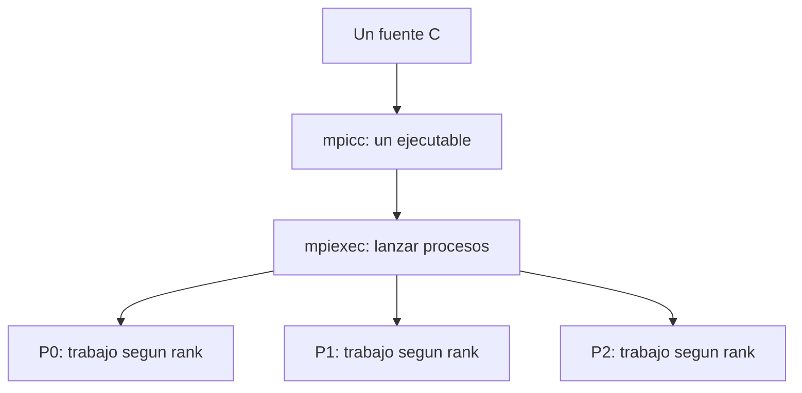
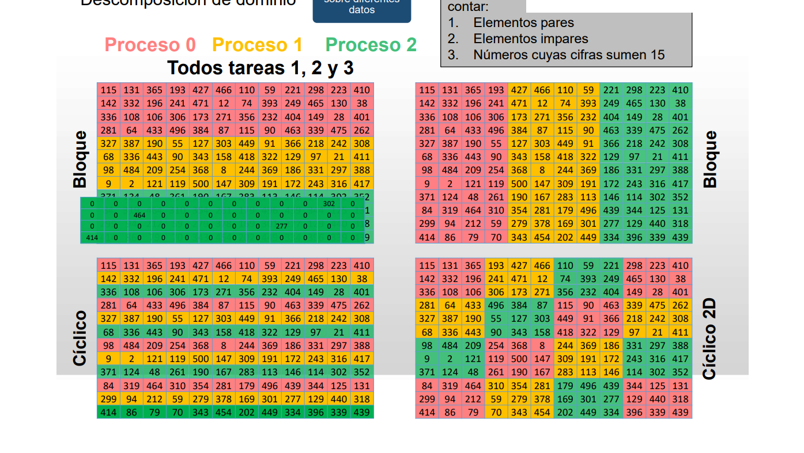
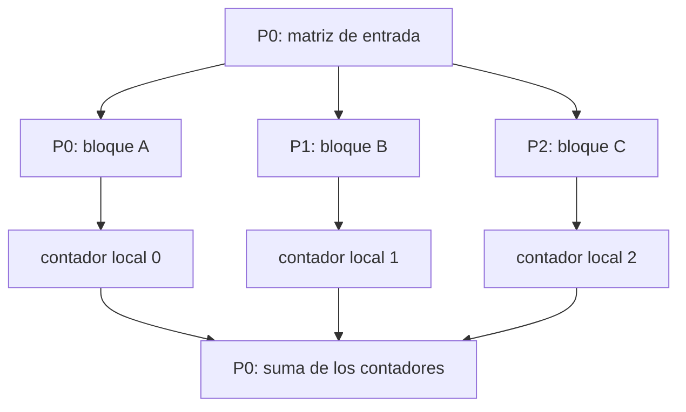
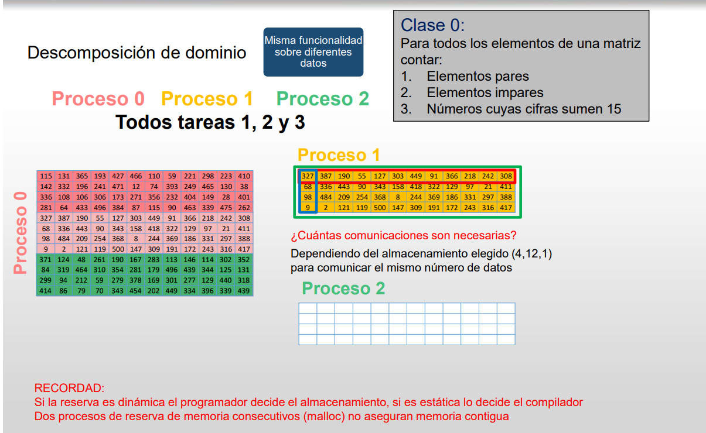

# Clase del 15 de septiembre: memoria distribuida y MPI

MPI permite que procesos con memoria propia intercambien datos. Antes de programar las comunicaciones, necesitamos una versión secuencial correcta, un reparto del trabajo y una descripción de los datos que necesita cada proceso.

## Procesos, hilos y recursos de cómputo

Un proceso tiene su propio espacio de direcciones. Los hilos de un mismo proceso comparten ese espacio, aunque cada hilo mantiene su ejecución y variables locales propias.

Un ejemplo de reparto consiste en dividir mil sumas entre dos trabajadores: cada uno calcula una parte y después se combinan los resultados. La comunicación o sincronización necesaria depende de las dependencias del algoritmo. No toda tarea paralela requiere comunicarse en cada paso, ni toda comunicación sincroniza a todos los participantes.

El resultado paralelo debe corresponder al resultado secuencial de referencia. Con enteros se puede exigir igualdad exacta si no hay desbordamiento; con punto flotante, un orden de suma diferente puede producir pequeñas diferencias de redondeo y conviene definir una tolerancia.

## Memoria distribuida

Los procesos pueden estar en nodos distintos conectados por una red o en un mismo equipo. Cada uno conserva su memoria local. Tener una variable con el mismo nombre en varios procesos no la convierte en compartida; incluso una dirección numérica igual pertenece al espacio de su proceso.

Un clúster suele reunir nodos con varios núcleos. MPI puede ejecutar varios procesos en los distintos núcleos de un nodo. También se puede combinar MPI entre procesos con OpenMP entre los hilos de cada proceso. No hay una regla que obligue a usar un solo proceso MPI por computador.

Para estudiar el algoritmo suponemos que los datos están disponibles en memoria; cuando un ejemplo incluye lectura de ficheros, esa lectura también forma parte del programa y puede influir en el tiempo total.

## Un ejecutable y varios procesos

En los ejemplos de la asignatura se usa el modelo SPMD: se compila un programa y se lanza en varios procesos. Todos ejecutan ese programa, pero sus rangos y condiciones determinan qué parte del trabajo realiza cada uno.

Compilar no inicia la ejecución paralela. El lanzador y el entorno MPI ponen en marcha los procesos y hacen posible su comunicación.

Es frecuente elegir P0 para leer la entrada y reunir resultados porque el rango 0 existe en cualquier comunicador no vacío. Es una decisión de diseño; MPI no exige un coordinador central y también permite otros patrones.

## Modelos de programación

### Paso de mensajes

Los procesos comunican datos explícitamente. En la comunicación punto a punto, un emisor hace Send y un receptor hace Recv. Podemos ver en el programa qué se transmite, a quién y en qué momento.

### Paralelismo de datos

Se aplica una operación a porciones diferentes de un conjunto de datos. Puede implementarse sobre memoria distribuida o compartida: no es una propiedad exclusiva de una arquitectura ni una alternativa incompatible con MPI.

HPF significa **High Performance Fortran** y es un ejemplo histórico de lenguaje orientado al paralelismo de datos. No se puede afirmar que Fortran sea siempre más eficiente que C: influyen el algoritmo, el compilador y la representación de los datos.

### Espacio de direcciones global sobre memoria distribuida

Modelos como PGAS presentan un espacio de direcciones global particionado. UPC significa **Unified Parallel C** y es un ejemplo de este enfoque.

Cuatro nodos con 64 GB cada uno tienen 256 GB de capacidad agregada, pero eso no crea automáticamente una memoria de acceso uniforme. Acceder a datos remotos puede necesitar comunicación y ser más costoso que un acceso local. La localidad y el balanceo siguen siendo importantes.

La abstracción facilita algunos programas, pero puede ocultar costes si el diseño no considera dónde residen los datos. Su conveniencia depende del problema; no es correcto declarar que siempre será un modelo no óptimo.

### Herramientas de menor nivel

Podrían usarse protocolos como TCP/UDP y herramientas del sistema operativo, pero habría que gestionar más detalles del transporte y la ejecución. MPI proporciona una interfaz de comunicación de nivel superior. La afinidad indica en qué recursos puede ejecutarse un trabajador; no sustituye al diseño del reparto.

## Qué es MPI y qué garantiza

MPI significa **Message Passing Interface**. Es un estándar desarrollado por el **MPI Forum**, no simplemente una biblioteca sin organismo responsable. Implementaciones como MPICH y Open MPI ofrecen esa interfaz. Microsoft MPI es una implementación para Windows; LAM/MPI es una referencia histórica.

El estándar define bindings para C y Fortran. Python puede utilizar MPI mediante bibliotecas como mpi4py; eso no convierte Python en un binding normativo equivalente al de C.

MPI abstrae detalles de la red y facilita escribir programas portables. La portabilidad presupone tipos, búferes, llamadas y patrones de comunicación válidos.

Los mensajes no se pierden arbitrariamente en una ejecución correcta, pero eso no elimina los errores: pueden existir rangos inválidos, tipos incompatibles, falta de memoria, bloqueos o fallos del entorno. Las funciones devuelven códigos de error y el manejador predeterminado puede abortar. No hay que suponer que toda aplicación MPI se recupera de la caída de un proceso.

### Rendimiento y escalabilidad

La escalabilidad depende del algoritmo, tamaño del problema, número de recursos, balanceo, memoria y red. No basta con comparar cuántos equipos se pueden conectar.

Una red de barras cruzadas puede ser costosa al crecer; una red Ethernet también puede sufrir congestión y limitaciones de ancho de banda. No se puede concluir que una sea siempre más escalable ni que añadir conexiones no degrade las prestaciones.

## Mensajes y sincronización

En los ejemplos con tipos básicos, un mensaje transmite una secuencia de elementos contiguos. MPI también permite tipos derivados que describen posiciones no contiguas; no los necesitamos para estos primeros ejercicios.

El nombre de la variable no identifica el mensaje. Para emparejarlo importan emisor, destinatario, etiqueta y contexto del comunicador. Los tipos deben ser compatibles y la recepción debe tener capacidad suficiente.

Send y Recv no tienen que empezar al mismo instante. Un Send estándar bloqueante puede usar almacenamiento interno o esperar una recepción, según la implementación y el mensaje. No se debe depender de que siempre exista espacio en un búfer interno.

Al terminar Send, el emisor puede reutilizar su búfer; no significa que el receptor ya haya completado todo su cálculo. Al terminar Recv, el receptor tiene los datos recibidos en su búfer.

### Comunicación unilateral

Las operaciones one-sided de MPI permiten acceder a una ventana de memoria de otro proceso sin un Recv por cada transferencia. Siguen necesitando creación de ventanas y reglas de sincronización/completado. No significan que nunca haya espera ni que el otro proceso no participe en la preparación.

Este tema se menciona para distinguir modelos; aquí trabajamos los algoritmos con comunicación explícita Send/Recv.

## Diseño paralelo y descomposición de dominio

El diseño debe responder:

1. ¿Qué datos y operaciones se reparten?
2. ¿Qué proceso necesita cada dato?
3. ¿Cuándo deben intercambiarse datos o resultados?
4. ¿Qué memoria necesita cada participante?
5. ¿Cómo se valida y mide el resultado?

Podemos distribuir una matriz por bloques de filas, bloques de columnas, filas cíclicas o bloques cíclicos. El reparto cíclico bidimensional aparece en bibliotecas de álgebra paralela. Ninguna distribución garantiza por sí sola el balanceo: importan los costes de las operaciones y la naturaleza de los datos.

### Ejemplo: contar elementos pares

P0 puede leer una matriz y distribuir bloques. Cada proceso cuenta los pares de su bloque y se combinan los contadores:

Cada proceso puede empezar su cómputo cuando tenga sus propios datos y se cumplan sus dependencias; no siempre hace falta esperar a que todos hayan recibido sus bloques.

Para sumar contadores, P0 solo necesita un acumulador y una variable temporal para las recepciones. No está obligado a guardar todos los bloques ni todos los resultados parciales a la vez. Si también lee la matriz completa, la reserva de entrada es otra necesidad distinta.

La ley de Amdahl describe una cota ideal debida a la parte secuencial. Los costes de comunicación y coordinación pueden hacer que el tiempo deje de mejorar o incluso aumente con más procesos.

## Repaso

- MPI trabaja con procesos; OpenMP, con hilos dentro de memoria compartida.
- El proceso 0 puede coordinar un ejemplo, pero no es una exigencia del estándar.
- El patrón de comunicación determina parte de las necesidades de memoria.
- Un tamaño de mensaje se expresa mediante cantidad de elementos y tipo.
- El cómputo secuencial sirve como referencia; el resultado y el rendimiento se comprueban por separado.

Referencia: [MPI Forum](https://www.mpi-forum.org/docs/) y [sincronización one-sided](https://www.mpi-forum.org/docs/mpi-2.2/mpi22-report/node238.htm).

[Siguiente clase: 22 de septiembre](22_septiembre.md).
