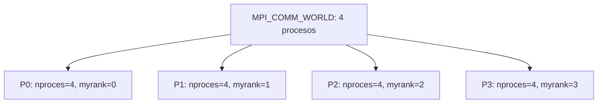

# Clase del 22 de septiembre: procesos, Send y Recv

Partimos de un programa secuencial correcto. El diseño paralelo fija el reparto del trabajo, las comunicaciones y la memoria de cada proceso. Los ejemplos de esta página distinguen lo que MPI devuelve como código de error de los resultados que escribe mediante punteros.

## Compilar, lanzar e inicializar

```text
fuente.c --mpicc--> ejecutable --mpiexec -n 4--> P0, P1, P2, P3
```

- **mpicc** compila y enlaza el programa con MPI.
- **mpiexec/mpirun** lanza los procesos.
- **MPI_Init** inicializa el entorno MPI dentro de cada proceso.
- **MPI_Finalize** finaliza su uso de MPI cuando se ha completado la participación del programa en las comunicaciones.

MPI_Init se ejecuta antes de las operaciones de comunicación de estos ejemplos. Puede haber código C antes o después del uso de MPI; no es obligatorio que Init sea literalmente la primera instrucción de main.

MPI_Finalize es colectiva en este modelo, pero no sustituye a MPI_Barrier ni corrige mensajes mal emparejados. Antes de finalizar debemos completar la participación en las comunicaciones; no hay que confiar en que Finalize descarte datos pendientes o detecte todos los errores del programa.

## Número de procesos y rango

```c
int nproces, myrank;
int ierr = MPI_Comm_size(MPI_COMM_WORLD, &nproces);
ierr = MPI_Comm_rank(MPI_COMM_WORLD, &myrank);
```

Cada función devuelve un **código de error**. El resultado consultado se escribe en la variable cuya dirección se pasa:

| Consulta con cuatro procesos | P0 | P1 | P2 | P3 |
|---|---:|---:|---:|---:|
| nproces, escrito por Comm_size | 4 | 4 | 4 | 4 |
| myrank, escrito por Comm_rank | 0 | 1 | 2 | 3 |

Por tanto, **no** se debe escribir `int myrank = MPI_Comm_rank(..., &myrank)`: se sobrescribiría el rango escrito con el código de retorno.



## Qué es MPI_COMM_WORLD

Es el comunicador predefinido de los procesos de la ejecución inicial en este modelo. Cada comunicador relaciona un grupo de procesos con un contexto de comunicación, para que sus mensajes no se confundan con los de otro contexto.

Podemos crear comunicadores para subconjuntos; un proceso puede pertenecer a varios y tener un rango diferente en cada uno. Crear un subgrupo no crea por sí mismo nuevos procesos. Los ejemplos de clase mantienen fijo el número de procesos, aunque otras funciones de MPI permiten gestión dinámica.

## Ejemplo completo: memoria local y salida

```c
#include <mpi.h>
#include <stdio.h>

int main(int argc, char **argv) {
    int nproces, myrank;
    int i = 0;

    MPI_Init(&argc, &argv);
    MPI_Comm_size(MPI_COMM_WORLD, &nproces);
    MPI_Comm_rank(MPI_COMM_WORLD, &myrank);

    i++;
    printf("Soy el proceso %d de %d procesos. Mi i vale %d.\n",
           myrank, nproces, i);

    MPI_Finalize();
    return 0;
}
```

Con cuatro procesos se ejecutan cuatro printf: uno por proceso. En todos, i vale 1 porque cada uno incrementa su propia variable. La salida puede aparecer, por ejemplo, en orden 0, 3, 1, 2 o 2, 0, 3, 1. El orden y la agrupación de las líneas de consola no están garantizados.

Modificar una variable local no modifica automáticamente la variable del mismo nombre en otro proceso. Incluye el rango en los mensajes de depuración para reconocer el origen.

## MPI_Send: qué se envía

```c
err = MPI_Send(DatosEnv, NumDatos, TipoDatos, Destino, tag, comunicador);
```

| Argumento | Significado |
|---|---|
| DatosEnv | Dirección de inicio de los datos. |
| NumDatos | Número de elementos del tipo, **no número de bytes**, salvo que el tipo sea de byte. |
| TipoDatos | Tipo MPI compatible con el dato C. |
| Destino | Rango del receptor dentro del comunicador. |
| tag | Etiqueta para distinguir comunicaciones. |
| comunicador | Contexto donde se identifica al destinatario y se empareja el mensaje. |

En C, usa MPI_INT para int y MPI_DOUBLE para double. MPI_INTEGER corresponde al binding de Fortran y no debe emplearse como sustituto general de MPI_INT en estos ejemplos.

```c
/* vector contiene al menos 16 enteros inicializados. */
MPI_Send(vector, 16, MPI_INT, destino, 99, MPI_COMM_WORLD);
```

La biblioteca recibe una dirección para leer los datos del emisor. No transmite el puntero como una dirección válida en el receptor. Este debe tener su propio búfer.

Un destino fuera de 0..nproces-1, salvo destinos especiales definidos por MPI, es inválido. Enviar más elementos de los que existen en el búfer es un error de memoria; no hay garantía de que siempre produzca un segmentation fault visible.

MPI_Send es bloqueante: cuando termina se puede reutilizar el búfer enviado. El modo estándar puede almacenar datos internamente o esperar al receptor. No garantiza que el receptor ya haya terminado su Recv o su cómputo, y no debemos depender de almacenamiento interno ilimitado.

## MPI_Recv: dónde se recibe

```c
err = MPI_Recv(DatosRec, Capacidad, TipoDatos, Origen, tag,
               comunicador, &status);
```

- DatosRec señala el búfer local donde se escribirá.
- Capacidad indica cuántos elementos caben en la recepción.
- Origen identifica el emisor esperado; MPI_ANY_SOURCE permite cualquiera.
- La etiqueta puede ser concreta o MPI_ANY_TAG.
- status informa del origen y etiqueta del mensaje recibido. La función devuelve un código de error, no el dato del mensaje.

MPI_Recv bloquea hasta completar la recepción de un mensaje compatible. El mensaje puede tener menos elementos que la capacidad: enviar dos enteros y recibir con capacidad cuatro es válido si el búfer tiene espacio. Las posiciones restantes no se rellenan automáticamente.

Si el mensaje contiene más datos que la capacidad, se produce truncamiento y un error MPI. Los tipos deben ser compatibles; tener igual cantidad de bytes no basta para justificar cualquier mezcla de tipos.

El emparejamiento se hace mediante emisor/destinatario, etiqueta y contexto del comunicador. Cantidad y tipo son condiciones de validez del contenido, no un mecanismo para seleccionar entre dos mensajes con el mismo sobre.

### Enviar y recibir no requiere coincidir en el tiempo

Las dos llamadas no tienen que comenzar simultáneamente. Lo importante es que cada envío tenga la recepción correcta y que el orden no cree un ciclo de esperas. Si no existe un mensaje que corresponda a una recepción, esta puede esperar indefinidamente.

Enviar a uno mismo está permitido por MPI. Sin embargo, un proceso con un único hilo que hace un Send bloqueante y solo después un Recv para ese mensaje puede bloquearse. En los ejemplos con raíz copiamos los datos locales directamente.

## Ejemplo completo: un double desde P0 hasta P3

Se necesitan al menos cuatro procesos:

```c
#include <mpi.h>
#include <stdio.h>

int main(int argc, char **argv) {
    int nproces, myrank;
    double data1 = 0.0, data2 = 0.0;
    MPI_Status status;

    MPI_Init(&argc, &argv);
    MPI_Comm_size(MPI_COMM_WORLD, &nproces);
    MPI_Comm_rank(MPI_COMM_WORLD, &myrank);

    if (nproces < 4) {
        if (myrank == 0) fprintf(stderr, "Se necesitan al menos 4 procesos.\n");
        MPI_Finalize();
        return 1;
    }

    if (myrank == 0) {
        data1 = 47645.3; /* En C el separador decimal es el punto. */
        MPI_Send(&data1, 1, MPI_DOUBLE, 3, 99, MPI_COMM_WORLD);
    } else if (myrank == 3) {
        MPI_Recv(&data2, 1, MPI_DOUBLE, 0, 99, MPI_COMM_WORLD, &status);
        printf("P3 recibe %.1f desde P%d.\n", data2, status.MPI_SOURCE);
    }

    MPI_Finalize();
    return 0;
}
```


P1 y P2 también ejecutan el programa, pero no realizan ese intercambio. Los nombres data1 y data2 pueden ser diferentes: los nombres de variables no emparejan mensajes.

### Casos incorrectos para trazar a mano

Partiendo del ejemplo anterior, cambia **una sola condición** y analiza el resultado:

| Cambio | Qué ocurre |
|---|---|
| Send usa tag 99 y P3 espera tag 88. | P3 no encuentra el envío; el mensaje 99 no satisface la recepción 88. |
| Send tiene destino 2, pero solo P3 recibe. | P3 espera un mensaje para él que nunca se envió y P2 no publica la recepción correspondiente. |
| P0 envía a P3, pero P3 espera origen 1. | La recepción espera a P1, no a P0. |
| La recepción se coloca en if (myrank == 100) al ejecutar cuatro procesos. | Ningún proceso ejecuta ese Recv; el Send a P3 queda sin recepción correspondiente. |

En cualquiera de estos casos el programa es incorrecto y puede bloquearse. Send puede esperar desde el principio o retornar tras almacenar datos: no se puede predecir una finalización válida basándose en el tamaño pequeño del mensaje. Finalize no garantiza vaciar automáticamente el búfer ni emitir un aviso que arregle la ejecución.

Estos casos son ejemplos de errores intencionados, no programas que deban ejecutarse sin una forma de cancelar una espera.

## Difundir un vector desde P1 con Send/Recv

Se necesitan al menos dos procesos. P1 inicializa los dieciséis enteros antes de enviarlos:

```c
#include <mpi.h>
#include <stdio.h>

int main(int argc, char **argv) {
    int nproces, myrank;
    int vector[16];

    MPI_Init(&argc, &argv);
    MPI_Comm_size(MPI_COMM_WORLD, &nproces);
    MPI_Comm_rank(MPI_COMM_WORLD, &myrank);

    if (nproces < 2) {
        if (myrank == 0) fprintf(stderr, "Se necesitan al menos 2 procesos.\n");
        MPI_Finalize();
        return 1;
    }

    if (myrank == 1) {
        for (int j = 0; j < 16; j++) vector[j] = j;
        for (int destino = 0; destino < nproces; destino++) {
            if (destino != 1)
                MPI_Send(vector, 16, MPI_INT, destino, 99, MPI_COMM_WORLD);
        }
    } else {
        MPI_Recv(vector, 16, MPI_INT, 1, 99, MPI_COMM_WORLD,
                 MPI_STATUS_IGNORE);
    }

    printf("P%d: primero=%d, ultimo=%d\n", myrank, vector[0], vector[15]);
    MPI_Finalize();
    return 0;
}
```

Cada proceso termina con [0,1,...,15]. vector y &vector[0] expresan la misma dirección inicial al pasarlos a estas funciones. El código repite los envíos en P1, mientras cada otro proceso ejecuta una recepción.

La colectiva equivalente sería MPI_Bcast(vector, 16, MPI_INT, 1, MPI_COMM_WORLD), llamada por todos, una vez que P1 ha preparado los datos. La misma funcionalidad no implica el mismo algoritmo interno.

## Comprobaciones antes de comunicar

1. ¿Existen el emisor y el receptor dentro del comunicador?
2. ¿Coinciden origen/destino, etiqueta y contexto?
3. ¿Son compatibles los tipos y hay capacidad suficiente?
4. ¿Se han inicializado los elementos enviados?
5. ¿Puede completarse cada envío sin una espera circular?
6. ¿Se completa la participación en las comunicaciones antes de Finalize?

Referencias: [sobre del mensaje](https://www.mpi-forum.org/docs/mpi-4.1/mpi41-report/node58.htm), [capacidad y tipos](https://www.mpi-forum.org/docs/mpi-4.1/mpi41-report/node107.htm) y [MPI_Finalize](https://docs.open-mpi.org/en/v5.0.0/man-openmpi/man3/MPI_Finalize.3.html).

[Repaso de la clase del 29 de septiembre](29_septiembre_revisado.md) · [Clase del 6 de octubre](06_octubre.md).
