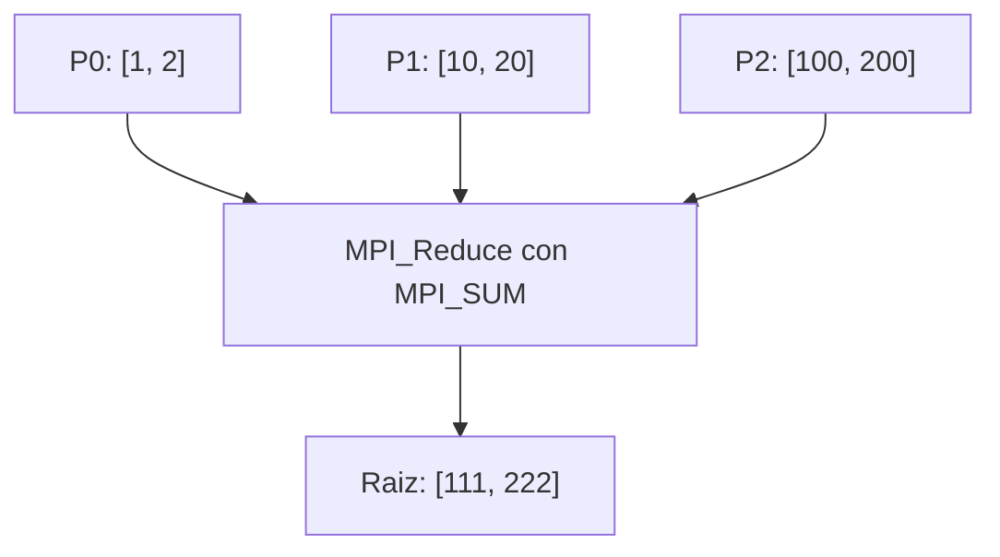

# Clase del 29 de septiembre: repaso de mensajes y colectivas

Versión revisada del [PDF original](29_septiembre.pdf). El archivo se llama 29_septiembre.pdf, aunque su cabecera interna muestra una fecha distinta; se conserva ese nombre para mantener la referencia existente.

## Funciones básicas y mayúsculas

En C, los nombres correctos son MPI_Comm_size y MPI_Comm_rank. Las versiones MPI_Comm_Size y MPI_Comm_Rank del PDF no son los nombres de la API.

```c
int nproces, rank;
MPI_Init(&argc, &argv);
MPI_Comm_size(MPI_COMM_WORLD, &nproces);
MPI_Comm_rank(MPI_COMM_WORLD, &rank);
/* Operaciones MPI. */
MPI_Finalize();
```

El código de retorno no es el resultado consultado: size y rank escriben mediante los punteros pasados. Para los enteros de C se emplea MPI_INT.

MPI_Finalize finaliza el entorno cuando se ha completado la participación en las comunicaciones. No es una herramienta para descartar envíos sin recepción ni para resolver un bloqueo del programa. Para una barrera explícita dentro del cómputo se usa MPI_Barrier.

## Bcast no identifica variables por su nombre

Todos los procesos del comunicador llaman a Bcast en un orden compatible, con la misma raíz y datos compatibles. Sus variables pueden tener nombres y direcciones distintos en cada proceso.

```c
/* En P0, entrada tiene el dato; en los demas, salida es su bufer local. */
if (rank == 0) {
    MPI_Bcast(&entrada, 1, MPI_INT, 0, MPI_COMM_WORLD);
} else {
    MPI_Bcast(&salida, 1, MPI_INT, 0, MPI_COMM_WORLD);
}
```

Es una única operación colectiva en la secuencia de cada proceso, aunque se haya escrito en dos ramas y con nombres diferentes. entrada y salida deben estar declaradas; entrada debe estar inicializada en P0.

Si solo participa un subconjunto, puede crearse un comunicador de ese grupo o usar mensajes punto a punto. No se debe llamar a una colectiva solo desde una parte de su comunicador.

## Reduce y Allreduce

Reduce combina aportaciones y entrega el resultado a una raíz, que también aporta. Todos los participantes llaman a la operación; no es una función que solo deba ejecutar la raíz.

Allreduce entrega el resultado a todos, sin parámetro raíz. Es equivalente conceptualmente a reducir y difundir, pero su implementación no necesita usar literalmente esas dos llamadas ni una raíz central.

Para count elementos, la reducción combina las posiciones correspondientes de las aportaciones:



Reducir un vector no lo transforma automáticamente en un único escalar. Si quieres un contador total, cada proceso puede calcular primero un contador local y reducir esos escalares.

### Operaciones

MPI_SUM suma, MPI_PROD multiplica, MPI_MAX obtiene máximos y MPI_MIN obtiene mínimos. Hay operaciones lógicas, de bits y de localización, con restricciones sobre los tipos admitidos.

El PDF etiqueta MPI_MINLOC como máximo y localización: es **mínimo y localización**. MPI_MAXLOC es máximo y localización. Estas operaciones trabajan con pares compatibles, por ejemplo valor e índice/rango, y requieren el tipo MPI de pares adecuado, como MPI_DOUBLE_INT para double/int. No basta con declarar cualquier struct y enviarlo como MPI_DOUBLE.

Los diagramas de [Reduce](Funciones%20colectivas/02_Reduce.md) y [Allreduce](Funciones%20colectivas/03_Allreduce.md) muestran ejemplos completos sencillos.

## Comodines y estado de recepción

MPI_ANY_SOURCE permite cualquier emisor y MPI_ANY_TAG cualquier etiqueta. Aun así, el destinatario y el comunicador deben corresponder, y los datos han de ser compatibles.

```c
int recibido;
MPI_Status status;
MPI_Recv(&recibido, 1, MPI_INT, MPI_ANY_SOURCE, MPI_ANY_TAG,
         MPI_COMM_WORLD, &status);
/* status.MPI_SOURCE y status.MPI_TAG indican lo que llego. */
```

El tamaño y el tipo no se usan para escoger otro mensaje con el mismo sobre. Una recepción con capacidad mayor que el mensaje es válida; con capacidad menor hay truncamiento. El contenido no recibido no pasa a constituir automáticamente otro mensaje independiente.

## Datos, buffers y punto decimal

El ejemplo del PDF escribe data1 = 47645,3. En C, para asignar el número decimal correcto hay que usar:

```c
data1 = 47645.3;
```

La coma se interpreta como un operador, no como separador decimal.

Send puede esperar o usar almacenamiento interno. Su retorno permite reutilizar el búfer local; no garantiza que el receptor ya haya acabado. No se debe asumir que todo envío se vuelca inmediatamente en un búfer del receptor.

Para un ejemplo completo P0→P3 y los casos de etiquetas/orígenes incorrectos, consulta [la clase del 22 de septiembre](22_septiembre.md).

## Aclaraciones respecto al PDF

| Página del original | Aclaración |
|---|---|
| 1 | Nombres size/rank, MPI_INT, participación de todos en las colectivas y nombres de variables independientes. |
| 2 | MINLOC, tipos de pares, Allreduce conceptual, comodines, buffers, capacidad de recepción y punto decimal. |
| 3 | La reducción de vectores es elemento a elemento; el contador escalar total requiere aportaciones escalares. |

Referencias: [MPI Forum, colectivas](https://www.mpi-forum.org/docs/mpi-3.1/mpi31-report/node95.htm), [tipos y capacidad](https://www.mpi-forum.org/docs/mpi-4.1/mpi41-report/node107.htm) y [finalización](https://docs.open-mpi.org/en/v5.0.0/man-openmpi/man3/MPI_Finalize.3.html).
