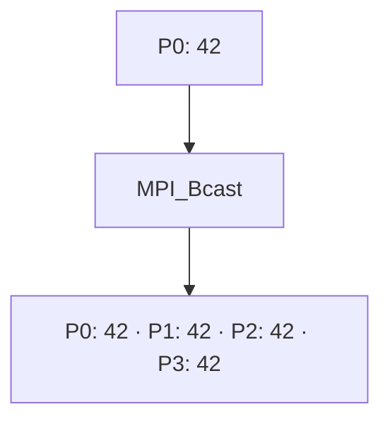

# MPI_Bcast

## Diagrama



**Lectura del diagrama:** P0: 42. Después: P0: 42 · P1: 42 · P2: 42 · P3: 42.

## Funcionamiento

Difunde el mismo dato desde la raíz a todos los procesos.

Todos llaman a la función, incluida la raíz (P0). `1` es la cantidad de elementos, `MPI_INT` su tipo y `0` el rango de la raíz. Al regresar, cada proceso tiene una copia de 42.

El diagrama representa el efecto de la operación, no el algoritmo interno de MPI. El ejemplo usa cuatro procesos en un intracomunicador, `MPI_COMM_WORLD`.

## Ejemplo completo en C

```c
#include <mpi.h>
#include <stdio.h>

int main(int argc, char **argv) {
    MPI_Init(&argc, &argv);
    int rank, size;
    MPI_Comm_rank(MPI_COMM_WORLD, &rank);
    MPI_Comm_size(MPI_COMM_WORLD, &size);
    if (size != 4) {
        if (rank == 0) fprintf(stderr, "Ejecuta con 4 procesos.\n");
        MPI_Finalize();
        return 1;
    }

    int dato = rank == 0 ? 42 : 0;
    MPI_Bcast(&dato, 1, MPI_INT, 0, MPI_COMM_WORLD);
    printf("P%d recibe %d\n", rank, dato);

    MPI_Finalize();
    return 0;
}
```

## Resultado esperado

Cada proceso imprime 42. El orden de las líneas puede variar.

## Cómo ejecutarlo

Guarda el código como `01_Bcast.c` y, en un entorno con MPI instalado:

```bash
mpicc 01_Bcast.c -o 01_Bcast
mpiexec -n 4 ./01_Bcast
```

[Volver al índice](README.md)
