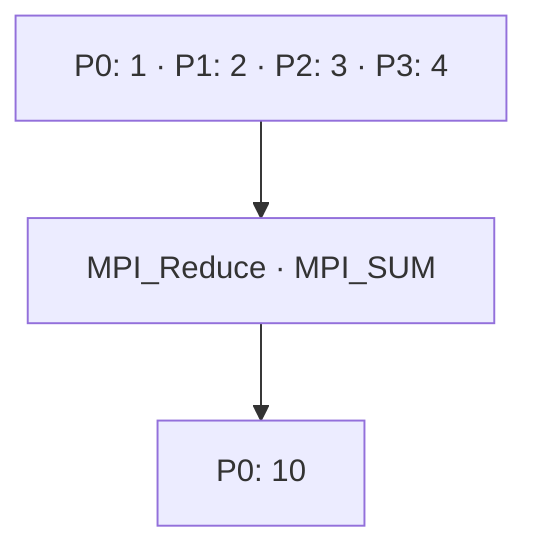

# MPI_Reduce

## Diagrama



**Lectura del diagrama:** P0: 1 · P1: 2 · P2: 3 · P3: 4. Después: P0: 10.

## Funcionamiento

Combina las contribuciones mediante una operación y deja el resultado en la raíz.

`local` es la aportación de cada proceso; `total` es el búfer de salida, significativo solo en la raíz. `MPI_SUM` suma 1 + 2 + 3 + 4. También se pueden reducir vectores elemento a elemento y usar operaciones como `MPI_MAX` o `MPI_MIN`.

El diagrama representa el efecto de la operación, no el algoritmo interno de MPI. El ejemplo usa cuatro procesos en un intracomunicador, `MPI_COMM_WORLD`.

## Ejemplo completo en C

```c
#include <mpi.h>
#include <stdio.h>

int main(int argc, char **argv) {
    MPI_Init(&argc, &argv);
    int rank, size;
    MPI_Comm_rank(MPI_COMM_WORLD, &rank);
    MPI_Comm_size(MPI_COMM_WORLD, &size);
    if (size != 4) {
        if (rank == 0) fprintf(stderr, "Ejecuta con 4 procesos.\n");
        MPI_Finalize();
        return 1;
    }

    int local = rank + 1;
    int total = 0;
    MPI_Reduce(&local, &total, 1, MPI_INT, MPI_SUM, 0, MPI_COMM_WORLD);
    if (rank == 0) printf("Total: %d\n", total);

    MPI_Finalize();
    return 0;
}
```

## Resultado esperado

P0 imprime Total: 10.

## Cómo ejecutarlo

Guarda el código como `02_Reduce.c` y, en un entorno con MPI instalado:

```bash
mpicc 02_Reduce.c -o 02_Reduce
mpiexec -n 4 ./02_Reduce
```

[Volver al índice](README.md)
