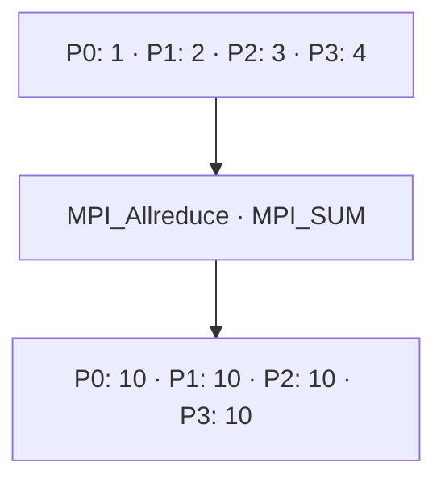

# MPI_Allreduce

## Diagrama



**Lectura del diagrama:** P0: 1 · P1: 2 · P2: 3 · P3: 4. Después: P0: 10 · P1: 10 · P2: 10 · P3: 10.

## Funcionamiento

Reduce las contribuciones y devuelve el resultado a todos.

No hay parámetro raíz. Cada proceso aporta `local` y recibe el total en `total`. Conceptualmente es una reducción seguida de una difusión; eso no determina su implementación interna.

El diagrama representa el efecto de la operación, no el algoritmo interno de MPI. El ejemplo usa cuatro procesos en un intracomunicador, `MPI_COMM_WORLD`.

## Ejemplo completo en C

```c
#include <mpi.h>
#include <stdio.h>

int main(int argc, char **argv) {
    MPI_Init(&argc, &argv);
    int rank, size;
    MPI_Comm_rank(MPI_COMM_WORLD, &rank);
    MPI_Comm_size(MPI_COMM_WORLD, &size);
    if (size != 4) {
        if (rank == 0) fprintf(stderr, "Ejecuta con 4 procesos.\n");
        MPI_Finalize();
        return 1;
    }

    int local = rank + 1;
    int total = 0;
    MPI_Allreduce(&local, &total, 1, MPI_INT, MPI_SUM, MPI_COMM_WORLD);
    printf("P%d: total = %d\n", rank, total);

    MPI_Finalize();
    return 0;
}
```

## Resultado esperado

Los cuatro procesos imprimen total = 10.

## Cómo ejecutarlo

Guarda el código como `03_Allreduce.c` y, en un entorno con MPI instalado:

```bash
mpicc 03_Allreduce.c -o 03_Allreduce
mpiexec -n 4 ./03_Allreduce
```

[Volver al índice](README.md)
