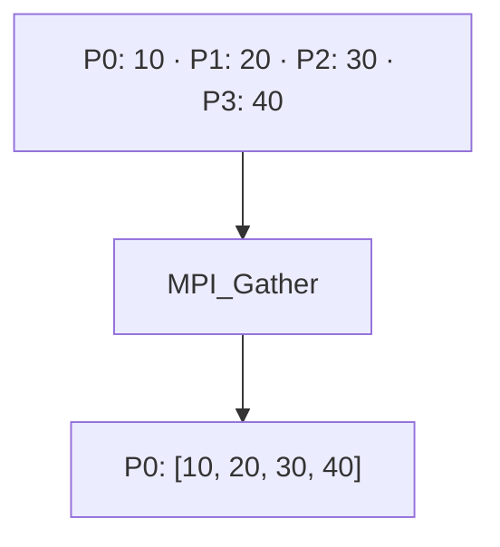

# MPI_Gather

## Diagrama



**Lectura del diagrama:** P0: 10 · P1: 20 · P2: 30 · P3: 40. Después: P0: [10, 20, 30, 40].

## Funcionamiento

Reúne bloques de igual tamaño en la raíz, ordenados por rango.

La raíz recibe un elemento de cada proceso, incluida ella misma. El segundo `1` indica lo recibido de cada proceso, no el total. `datos` solo contiene el resultado de la colectiva en P0. Gather conserva los valores por separado; no los suma.

El diagrama representa el efecto de la operación, no el algoritmo interno de MPI. El ejemplo usa cuatro procesos en un intracomunicador, `MPI_COMM_WORLD`.

## Ejemplo completo en C

```c
#include <mpi.h>
#include <stdio.h>

int main(int argc, char **argv) {
    MPI_Init(&argc, &argv);
    int rank, size;
    MPI_Comm_rank(MPI_COMM_WORLD, &rank);
    MPI_Comm_size(MPI_COMM_WORLD, &size);
    if (size != 4) {
        if (rank == 0) fprintf(stderr, "Ejecuta con 4 procesos.\n");
        MPI_Finalize();
        return 1;
    }

    int local = (rank + 1) * 10;
    int datos[4];
    MPI_Gather(&local, 1, MPI_INT, datos, 1, MPI_INT, 0, MPI_COMM_WORLD);
    if (rank == 0) {
        for (int i = 0; i < 4; i++) printf("%d ", datos[i]);
        printf("\n");
    }

    MPI_Finalize();
    return 0;
}
```

## Resultado esperado

P0 imprime 10 20 30 40.

## Cómo ejecutarlo

Guarda el código como `04_Gather.c` y, en un entorno con MPI instalado:

```bash
mpicc 04_Gather.c -o 04_Gather
mpiexec -n 4 ./04_Gather
```

[Volver al índice](README.md)
