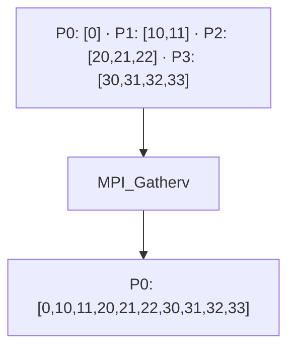

# MPI_Gatherv

## Diagrama



**Lectura del diagrama:** P0: [0] · P1: [10,11] · P2: [20,21,22] · P3: [30,31,32,33]. Después: P0: [0,10,11,20,21,22,30,31,32,33].

## Funcionamiento

Reúne bloques de diferentes tamaños en la raíz.

`cantidades[i]` indica cuántos elementos recibe la raíz de Pi. `desplazamientos[i]` indica dónde empieza ese bloque en el búfer de la raíz, medido en extensiones del tipo de recepción (aquí, posiciones de enteros). Estas dos tablas son significativas en la raíz. Cada cantidad debe concordar con lo enviado por ese proceso.

El diagrama representa el efecto de la operación, no el algoritmo interno de MPI. El ejemplo usa cuatro procesos en un intracomunicador, `MPI_COMM_WORLD`.

## Ejemplo completo en C

```c
#include <mpi.h>
#include <stdio.h>

int main(int argc, char **argv) {
    MPI_Init(&argc, &argv);
    int rank, size;
    MPI_Comm_rank(MPI_COMM_WORLD, &rank);
    MPI_Comm_size(MPI_COMM_WORLD, &size);
    if (size != 4) {
        if (rank == 0) fprintf(stderr, "Ejecuta con 4 procesos.\n");
        MPI_Finalize();
        return 1;
    }

    int n = rank + 1;
    int local[4];
    for (int i = 0; i < n; i++) local[i] = rank * 10 + i;
    int datos[10];
    int cantidades[4] = {1, 2, 3, 4};
    int desplazamientos[4] = {0, 1, 3, 6};
    MPI_Gatherv(local, n, MPI_INT, datos, cantidades,
                desplazamientos, MPI_INT, 0, MPI_COMM_WORLD);
    if (rank == 0) {
        for (int i = 0; i < 10; i++) printf("%d ", datos[i]);
        printf("\n");
    }

    MPI_Finalize();
    return 0;
}
```

## Resultado esperado

P0 imprime 0 10 11 20 21 22 30 31 32 33.

## Cómo ejecutarlo

Guarda el código como `05_Gatherv.c` y, en un entorno con MPI instalado:

```bash
mpicc 05_Gatherv.c -o 05_Gatherv
mpiexec -n 4 ./05_Gatherv
```

[Volver al índice](README.md)
