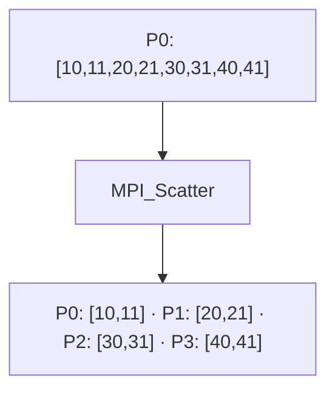

# MPI_Scatter

## Diagrama



**Lectura del diagrama:** P0: [10,11,20,21,30,31,40,41]. Después: P0: [10,11] · P1: [20,21] · P2: [30,31] · P3: [40,41].

## Funcionamiento

Divide los datos de la raíz en bloques iguales y entrega uno a cada proceso.

El primer `2` es la cantidad enviada a cada proceso, no el tamaño total. La raíz también recibe su bloque. El búfer de envío solo es significativo en la raíz. A diferencia de Bcast, cada proceso obtiene una parte distinta.

El diagrama representa el efecto de la operación, no el algoritmo interno de MPI. El ejemplo usa cuatro procesos en un intracomunicador, `MPI_COMM_WORLD`.

## Ejemplo completo en C

```c
#include <mpi.h>
#include <stdio.h>

int main(int argc, char **argv) {
    MPI_Init(&argc, &argv);
    int rank, size;
    MPI_Comm_rank(MPI_COMM_WORLD, &rank);
    MPI_Comm_size(MPI_COMM_WORLD, &size);
    if (size != 4) {
        if (rank == 0) fprintf(stderr, "Ejecuta con 4 procesos.\n");
        MPI_Finalize();
        return 1;
    }

    int datos[8] = {10, 11, 20, 21, 30, 31, 40, 41};
    int local[2];
    MPI_Scatter(datos, 2, MPI_INT, local, 2, MPI_INT, 0, MPI_COMM_WORLD);
    printf("P%d: %d %d\n", rank, local[0], local[1]);

    MPI_Finalize();
    return 0;
}
```

## Resultado esperado

P0 recibe 10 11; P1, 20 21; P2, 30 31; P3, 40 41.

## Cómo ejecutarlo

Guarda el código como `06_Scatter.c` y, en un entorno con MPI instalado:

```bash
mpicc 06_Scatter.c -o 06_Scatter
mpiexec -n 4 ./06_Scatter
```

[Volver al índice](README.md)
