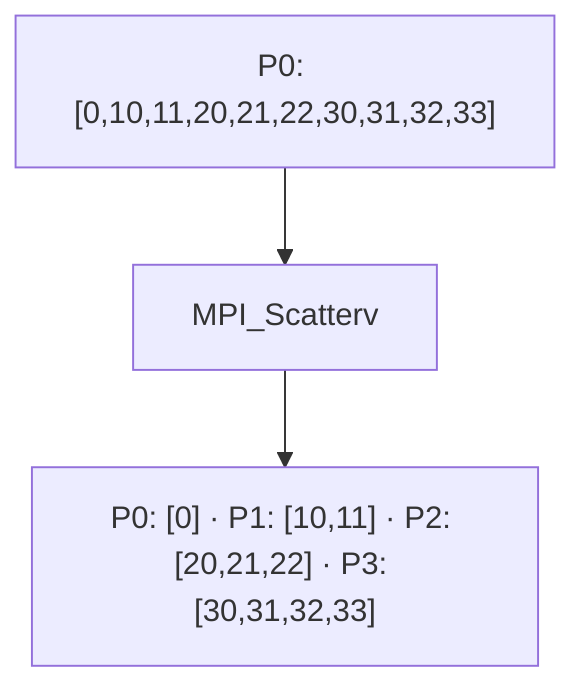

# MPI_Scatterv

## Diagrama



**Lectura del diagrama:** P0: [0,10,11,20,21,22,30,31,32,33]. Después: P0: [0] · P1: [10,11] · P2: [20,21,22] · P3: [30,31,32,33].

## Funcionamiento

Reparte bloques de tamaños diferentes desde la raíz.

`cantidades[i]` define cuánto envía la raíz a Pi; `desplazamientos[i]`, el inicio del bloque en el búfer de envío, en extensiones del tipo (aquí, posiciones de enteros). El búfer y las tablas de envío son significativos en la raíz. Cada proceso debe disponer de espacio para su bloque y usar la cantidad correspondiente.

El diagrama representa el efecto de la operación, no el algoritmo interno de MPI. El ejemplo usa cuatro procesos en un intracomunicador, `MPI_COMM_WORLD`.

## Ejemplo completo en C

```c
#include <mpi.h>
#include <stdio.h>

int main(int argc, char **argv) {
    MPI_Init(&argc, &argv);
    int rank, size;
    MPI_Comm_rank(MPI_COMM_WORLD, &rank);
    MPI_Comm_size(MPI_COMM_WORLD, &size);
    if (size != 4) {
        if (rank == 0) fprintf(stderr, "Ejecuta con 4 procesos.\n");
        MPI_Finalize();
        return 1;
    }

    int datos[10] = {0, 10, 11, 20, 21, 22, 30, 31, 32, 33};
    int cantidades[4] = {1, 2, 3, 4};
    int desplazamientos[4] = {0, 1, 3, 6};
    int n = rank + 1;
    int local[4];
    MPI_Scatterv(datos, cantidades, desplazamientos, MPI_INT,
                 local, n, MPI_INT, 0, MPI_COMM_WORLD);
    printf("P%d:", rank);
    for (int i = 0; i < n; i++) printf(" %d", local[i]);
    printf("\n");

    MPI_Finalize();
    return 0;
}
```

## Resultado esperado

P0 recibe 0; P1, 10 11; P2, 20 21 22; P3, 30 31 32 33.

## Cómo ejecutarlo

Guarda el código como `07_Scatterv.c` y, en un entorno con MPI instalado:

```bash
mpicc 07_Scatterv.c -o 07_Scatterv
mpiexec -n 4 ./07_Scatterv
```

[Volver al índice](README.md)
