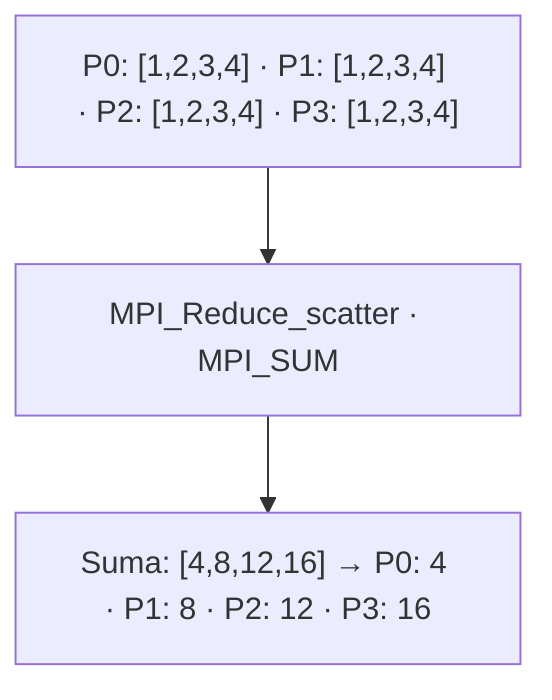

# MPI_Reduce_scatter

## Diagrama



**Lectura del diagrama:** P0: [1,2,3,4] · P1: [1,2,3,4] · P2: [1,2,3,4] · P3: [1,2,3,4]. Después: Suma: [4,8,12,16] → P0: 4 · P1: 8 · P2: 12 · P3: 16.

## Funcionamiento

Primero reduce vectores elemento a elemento y después reparte el vector reducido.

No tiene raíz. Todos aportan un vector de longitud igual a la suma de `cantidades`: cuatro elementos en este ejemplo. La reducción suma cada posición de los cuatro vectores. Pi recibe `cantidades[i]` elementos del vector reducido, en bloques consecutivos por rango. Todos deben usar la misma tabla de cantidades. No es una suma de todo el vector en un único escalar.

El diagrama representa el efecto de la operación, no el algoritmo interno de MPI. El ejemplo usa cuatro procesos en un intracomunicador, `MPI_COMM_WORLD`.

## Ejemplo completo en C

```c
#include <mpi.h>
#include <stdio.h>

int main(int argc, char **argv) {
    MPI_Init(&argc, &argv);
    int rank, size;
    MPI_Comm_rank(MPI_COMM_WORLD, &rank);
    MPI_Comm_size(MPI_COMM_WORLD, &size);
    if (size != 4) {
        if (rank == 0) fprintf(stderr, "Ejecuta con 4 procesos.\n");
        MPI_Finalize();
        return 1;
    }

    int entrada[4] = {1, 2, 3, 4};
    int cantidades[4] = {1, 1, 1, 1};
    int local;
    MPI_Reduce_scatter(entrada, &local, cantidades, MPI_INT,
                       MPI_SUM, MPI_COMM_WORLD);
    printf("P%d recibe %d\n", rank, local);

    MPI_Finalize();
    return 0;
}
```

## Resultado esperado

P0 recibe 4; P1, 8; P2, 12; P3, 16.

## Cómo ejecutarlo

Guarda el código como `08_Reduce_scatter.c` y, en un entorno con MPI instalado:

```bash
mpicc 08_Reduce_scatter.c -o 08_Reduce_scatter
mpiexec -n 4 ./08_Reduce_scatter
```

[Volver al índice](README.md)
