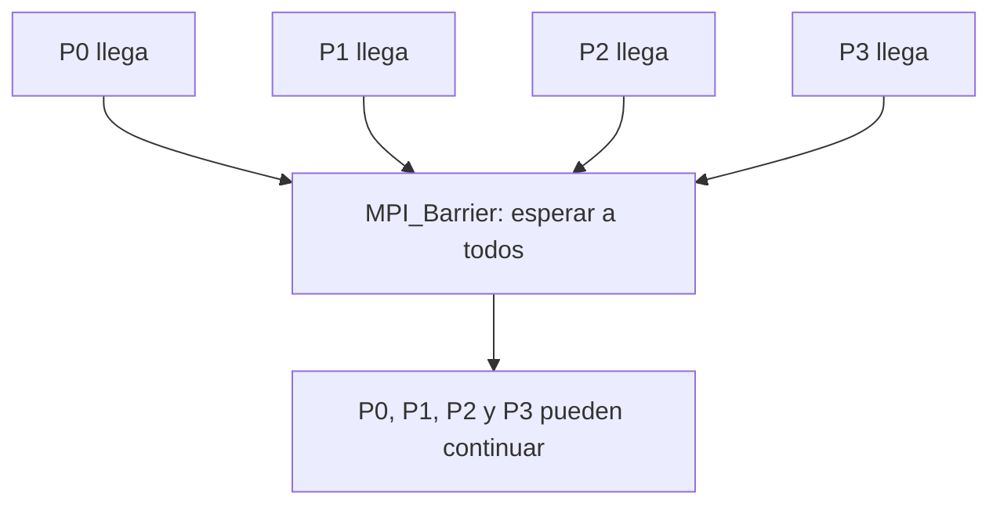

# MPI_Barrier

## Diagrama



**Lectura del diagrama:** P0, P1, P2 y P3 llegan en momentos distintos. Después: Todos han llegado → cada proceso puede continuar.

## Funcionamiento

Sincroniza: nadie termina la llamada hasta que todos han entrado en ella.

No intercambia datos del programa ni tiene raíz. Un proceso que llega pronto espera a los demás. Una vez que todos han entrado, pueden continuar; no tienen que salir en el mismo instante. El orden visible de los mensajes de consola puede variar por el almacenamiento y transporte de la salida.

El diagrama representa el efecto de la operación, no el algoritmo interno de MPI. El ejemplo usa cuatro procesos en un intracomunicador, `MPI_COMM_WORLD`.

## Ejemplo completo en C

```c
#include <mpi.h>
#include <stdio.h>

int main(int argc, char **argv) {
    MPI_Init(&argc, &argv);
    int rank, size;
    MPI_Comm_rank(MPI_COMM_WORLD, &rank);
    MPI_Comm_size(MPI_COMM_WORLD, &size);
    if (size != 4) {
        if (rank == 0) fprintf(stderr, "Ejecuta con 4 procesos.\n");
        MPI_Finalize();
        return 1;
    }

    printf("P%d antes de la barrera\n", rank);
    MPI_Barrier(MPI_COMM_WORLD);
    printf("P%d despues de la barrera\n", rank);

    MPI_Finalize();
    return 0;
}
```

## Resultado esperado

Cada proceso ejecuta su segundo printf después de que todos hayan entrado en la barrera.

## Cómo ejecutarlo

Guarda el código como `09_Barrier.c` y, en un entorno con MPI instalado:

```bash
mpicc 09_Barrier.c -o 09_Barrier
mpiexec -n 4 ./09_Barrier
```

[Volver al índice](README.md)
