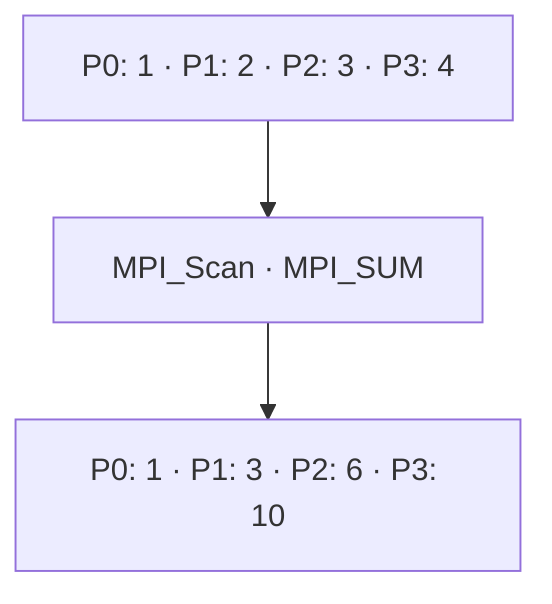

# MPI_Scan

## Diagrama



**Lectura del diagrama:** P0: 1 · P1: 2 · P2: 3 · P3: 4. Después: P0: 1 · P1: 3 · P2: 6 · P3: 10.

## Funcionamiento

Calcula una reducción acumulada inclusiva siguiendo el orden de los rangos.

Pi recibe la reducción de las aportaciones de P0 hasta Pi, incluida la suya. Con suma, P2 recibe 1 + 2 + 3 = 6. No tiene raíz y, a diferencia de Allreduce, los resultados pueden ser distintos según el rango. Esta función aparece en los apuntes del 6 de octubre.

El diagrama representa el efecto de la operación, no el algoritmo interno de MPI. El ejemplo usa cuatro procesos en un intracomunicador, `MPI_COMM_WORLD`.

## Ejemplo completo en C

```c
#include <mpi.h>
#include <stdio.h>

int main(int argc, char **argv) {
    MPI_Init(&argc, &argv);
    int rank, size;
    MPI_Comm_rank(MPI_COMM_WORLD, &rank);
    MPI_Comm_size(MPI_COMM_WORLD, &size);
    if (size != 4) {
        if (rank == 0) fprintf(stderr, "Ejecuta con 4 procesos.\n");
        MPI_Finalize();
        return 1;
    }

    int local = rank + 1;
    int acumulado;
    MPI_Scan(&local, &acumulado, 1, MPI_INT, MPI_SUM, MPI_COMM_WORLD);
    printf("P%d: acumulado = %d\n", rank, acumulado);

    MPI_Finalize();
    return 0;
}
```

## Resultado esperado

P0 obtiene 1; P1, 3; P2, 6; P3, 10.

## Cómo ejecutarlo

Guarda el código como `10_Scan.c` y, en un entorno con MPI instalado:

```bash
mpicc 10_Scan.c -o 10_Scan
mpiexec -n 4 ./10_Scan
```

[Volver al índice](README.md)
