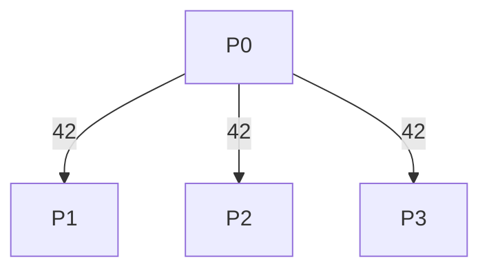

# MPI_Bcast con Send y Recv

## Diagrama



## Funcionamiento

P0 conserva 42 y envía una copia a P1, P2 y P3. Cada receptor hace un Recv cuyo origen es P0. La raíz no se envía a sí misma.

**Ejemplo del diagrama:** Todos obtienen 42.

## Algoritmo y bloqueos

La raíz puede bloquearse en cada Send hasta que el receptor correspondiente publique su Recv; todos los receptores lo hacen sin esperar otro mensaje.

Se usan mensajes bloqueantes, origen explícito y etiquetas reservadas. El algoritmo no depende de que MPI almacene los envíos en un búfer interno.

## Código con la colectiva original

Este bloque se coloca dentro de `main`, después de inicializar MPI y obtener `rank` y `size`. Usa los mismos datos y cuatro procesos que el ejemplo punto a punto. Es una alternativa al bloque de mensajes, no un bloque que se deba ejecutar junto a él.

```c
int dato = rank == 0 ? 42 : 0;
MPI_Bcast(&dato, 1, MPI_INT, 0, MPI_COMM_WORLD);
printf("P%d: %d\n", rank, dato);
```

## Implementación punto a punto, paso a paso

La llamada colectiva distribuye un elemento de P0. En punto a punto, P0 repite un Send por receptor; cada otro proceso hace un Recv desde P0. La raíz conserva su valor sin enviarse un mensaje a sí misma.

Los argumentos de cada mensaje son: dirección del búfer, cantidad de elementos, tipo (`MPI_INT`), destino en Send u origen en Recv, etiqueta y comunicador. Recv añade el argumento de estado; `MPI_STATUS_IGNORE` indica que no necesitamos consultarlo. El origen, destino, etiqueta y comunicador deben corresponder entre ambos mensajes.

## Código completo con MPI_Send y MPI_Recv

Programa independiente: [01_Bcast.c](01_Bcast.c). Toda la implementación está dentro de `main`, sin cabeceras propias ni funciones auxiliares ocultas.

```c
#include <mpi.h>
#include <stdio.h>

int main(int argc, char **argv) {
    MPI_Init(&argc, &argv);
    int rank, size;
    MPI_Comm_rank(MPI_COMM_WORLD, &rank);
    MPI_Comm_size(MPI_COMM_WORLD, &size);
    if (size != 4) {
        if (rank == 0) fprintf(stderr, "Ejecuta con 4 procesos.\n");
        MPI_Finalize();
        return 1;
    }

    int dato = rank == 0 ? 42 : 0;
    const int etiqueta = 101;
    
    if (rank == 0) {
        for (int destino = 1; destino < size; destino++)
            MPI_Send(&dato, 1, MPI_INT, destino, etiqueta, MPI_COMM_WORLD);
    } else {
        MPI_Recv(&dato, 1, MPI_INT, 0, etiqueta, MPI_COMM_WORLD,
                 MPI_STATUS_IGNORE);
    }
    printf("P%d: %d\n", rank, dato);

    MPI_Finalize();
    return 0;
}
```

## Compilar y ejecutar

Desde esta carpeta, en un entorno con MPI instalado:

```bash
mpicc -std=c99 01_Bcast.c -o 01_Bcast
mpiexec -n 4 ./01_Bcast
```

El orden de los printf de procesos distintos puede variar. Estos programas usan datos y tamaños preparados para exactamente cuatro procesos.

[Volver al índice](README.md)
