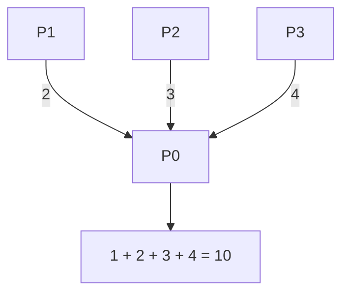

# MPI_Reduce con Send y Recv

## Diagrama



## Funcionamiento

P1, P2 y P3 envían sus valores a P0. P0 inicia el resultado con su propia aportación, recibe una a una las demás y las suma. Este programa reduce un escalar; para extenderlo a vectores habría que recibir y sumar cada posición.

**Ejemplo del diagrama:** Solo P0 obtiene 10.

## Algoritmo y bloqueos

Los emisores pueden esperar, pero la raíz recibe de todos. No es necesario que Send disponga de un búfer interno para que el algoritmo avance.

Se usan mensajes bloqueantes, origen explícito y etiquetas reservadas. El algoritmo no depende de que MPI almacene los envíos en un búfer interno.

## Código con la colectiva original

Este bloque se coloca dentro de `main`, después de inicializar MPI y obtener `rank` y `size`. Usa los mismos datos y cuatro procesos que el ejemplo punto a punto. Es una alternativa al bloque de mensajes, no un bloque que se deba ejecutar junto a él.

```c
int local = rank + 1, total;
MPI_Reduce(&local, &total, 1, MPI_INT, MPI_SUM, 0, MPI_COMM_WORLD);
if (rank == 0) printf("Total: %d\n", total);
```

## Implementación punto a punto, paso a paso

La colectiva combina con MPI_SUM y entrega el total a P0. En punto a punto, cada otro proceso envía su aportación; P0 recibe en una variable temporal y ejecuta total += recibido. Inicializa total con su propia aportación.

Los argumentos de cada mensaje son: dirección del búfer, cantidad de elementos, tipo (`MPI_INT`), destino en Send u origen en Recv, etiqueta y comunicador. Recv añade el argumento de estado; `MPI_STATUS_IGNORE` indica que no necesitamos consultarlo. El origen, destino, etiqueta y comunicador deben corresponder entre ambos mensajes.

## Código completo con MPI_Send y MPI_Recv

Programa independiente: [02_Reduce.c](02_Reduce.c). Toda la implementación está dentro de `main`, sin cabeceras propias ni funciones auxiliares ocultas.

```c
#include <mpi.h>
#include <stdio.h>

int main(int argc, char **argv) {
    MPI_Init(&argc, &argv);
    int rank, size;
    MPI_Comm_rank(MPI_COMM_WORLD, &rank);
    MPI_Comm_size(MPI_COMM_WORLD, &size);
    if (size != 4) {
        if (rank == 0) fprintf(stderr, "Ejecuta con 4 procesos.\n");
        MPI_Finalize();
        return 1;
    }

    int local = rank + 1;
    int total = 0;
    const int etiqueta = 102;
    
    if (rank == 0) {
        total = local; /* La raiz tambien aporta su valor. */
        for (int origen = 1; origen < size; origen++) {
            int recibido;
            MPI_Recv(&recibido, 1, MPI_INT, origen, etiqueta,
                     MPI_COMM_WORLD, MPI_STATUS_IGNORE);
            total += recibido;
        }
        printf("Total: %d\n", total);
    } else {
        MPI_Send(&local, 1, MPI_INT, 0, etiqueta, MPI_COMM_WORLD);
    }

    MPI_Finalize();
    return 0;
}
```

## Compilar y ejecutar

Desde esta carpeta, en un entorno con MPI instalado:

```bash
mpicc -std=c99 02_Reduce.c -o 02_Reduce
mpiexec -n 4 ./02_Reduce
```

El orden de los printf de procesos distintos puede variar. Estos programas usan datos y tamaños preparados para exactamente cuatro procesos.

[Volver al índice](README.md)
