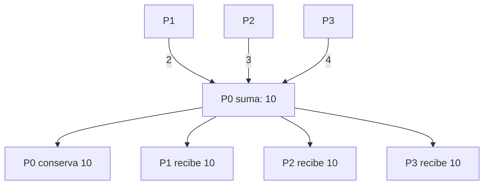

# MPI_Allreduce con Send y Recv

## Diagrama



## Funcionamiento

Primero P0 recibe y suma las aportaciones con Send y Recv. Después P0 manda el total a todos. El uso de P0 es una decisión interna de este algoritmo: la operación no requiere un parámetro raíz.

**Ejemplo del diagrama:** Todos obtienen 10.

## Algoritmo y bloqueos

Cada proceso termina su envío antes de esperar el total. La raíz recoge todas las aportaciones antes de difundir. La etiqueta de difusión es distinta de la de reducción.

Se usan mensajes bloqueantes, origen explícito y etiquetas reservadas. El algoritmo no depende de que MPI almacene los envíos en un búfer interno.

## Código con la colectiva original

Este bloque se coloca dentro de `main`, después de inicializar MPI y obtener `rank` y `size`. Usa los mismos datos y cuatro procesos que el ejemplo punto a punto. Es una alternativa al bloque de mensajes, no un bloque que se deba ejecutar junto a él.

```c
int local = rank + 1, total;
MPI_Allreduce(&local, &total, 1, MPI_INT, MPI_SUM, MPI_COMM_WORLD);
printf("P%d: %d\n", rank, total);
```

## Implementación punto a punto, paso a paso

La colectiva entrega la suma a todos sin parámetro raíz. El algoritmo punto a punto elige P0 como coordinador: primero recibe y suma, luego envía el total. Los demás hacen Send de su valor seguido de Recv del total. Las dos fases tienen etiquetas distintas y están escritas aquí completas.

Los argumentos de cada mensaje son: dirección del búfer, cantidad de elementos, tipo (`MPI_INT`), destino en Send u origen en Recv, etiqueta y comunicador. Recv añade el argumento de estado; `MPI_STATUS_IGNORE` indica que no necesitamos consultarlo. El origen, destino, etiqueta y comunicador deben corresponder entre ambos mensajes.

## Código completo con MPI_Send y MPI_Recv

Programa independiente: [03_Allreduce.c](03_Allreduce.c). Toda la implementación está dentro de `main`, sin cabeceras propias ni funciones auxiliares ocultas.

```c
#include <mpi.h>
#include <stdio.h>

int main(int argc, char **argv) {
    MPI_Init(&argc, &argv);
    int rank, size;
    MPI_Comm_rank(MPI_COMM_WORLD, &rank);
    MPI_Comm_size(MPI_COMM_WORLD, &size);
    if (size != 4) {
        if (rank == 0) fprintf(stderr, "Ejecuta con 4 procesos.\n");
        MPI_Finalize();
        return 1;
    }

    int local = rank + 1;
    int total = 0;
    const int llegada = 102, reparto = 103;
    
    if (rank == 0) {
        /* Fase 1: recoger y sumar las aportaciones. */
        total = local;
        for (int origen = 1; origen < size; origen++) {
            int recibido;
            MPI_Recv(&recibido, 1, MPI_INT, origen, llegada,
                     MPI_COMM_WORLD, MPI_STATUS_IGNORE);
            total += recibido;
        }
        /* Fase 2: enviar el resultado a todos. */
        for (int destino = 1; destino < size; destino++)
            MPI_Send(&total, 1, MPI_INT, destino, reparto, MPI_COMM_WORLD);
    } else {
        MPI_Send(&local, 1, MPI_INT, 0, llegada, MPI_COMM_WORLD);
        MPI_Recv(&total, 1, MPI_INT, 0, reparto, MPI_COMM_WORLD,
                 MPI_STATUS_IGNORE);
    }
    printf("P%d: %d\n", rank, total);

    MPI_Finalize();
    return 0;
}
```

## Compilar y ejecutar

Desde esta carpeta, en un entorno con MPI instalado:

```bash
mpicc -std=c99 03_Allreduce.c -o 03_Allreduce
mpiexec -n 4 ./03_Allreduce
```

El orden de los printf de procesos distintos puede variar. Estos programas usan datos y tamaños preparados para exactamente cuatro procesos.

[Volver al índice](README.md)
