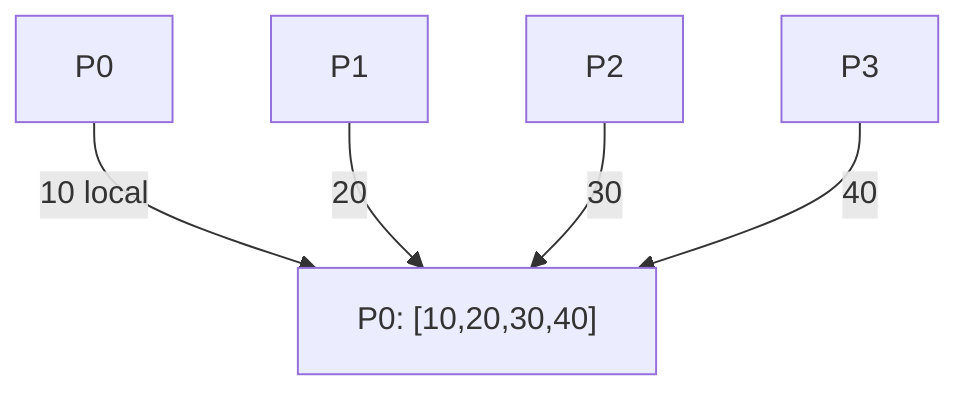

# MPI_Gather con Send y Recv

## Diagrama



## Funcionamiento

Cada proceso aporta un entero. P0 guarda su valor en datos[0] y recibe cada aportación en datos[origen], por rango. Se reúnen los datos sin sumarlos.

**Ejemplo del diagrama:** P0 obtiene [10,20,30,40].

## Algoritmo y bloqueos

La raíz recibe siguiendo los rangos y coloca cada bloque en su posición. El orden de llegada no modifica el resultado.

Se usan mensajes bloqueantes, origen explícito y etiquetas reservadas. El algoritmo no depende de que MPI almacene los envíos en un búfer interno.

## Código con la colectiva original

Este bloque se coloca dentro de `main`, después de inicializar MPI y obtener `rank` y `size`. Usa los mismos datos y cuatro procesos que el ejemplo punto a punto. Es una alternativa al bloque de mensajes, no un bloque que se deba ejecutar junto a él.

```c
int local = (rank + 1) * 10, datos[4];
MPI_Gather(&local, 1, MPI_INT, datos, 1, MPI_INT, 0, MPI_COMM_WORLD);
if (rank == 0) {
    for (int i = 0; i < size; i++) printf("%d ", datos[i]);
    printf("\n");
}
```

## Implementación punto a punto, paso a paso

La colectiva recibe un elemento por proceso. En punto a punto, P0 copia su valor en datos[0] y recibe el de Pi directamente en datos[i]. No se realiza ninguna operación aritmética sobre las aportaciones.

Los argumentos de cada mensaje son: dirección del búfer, cantidad de elementos, tipo (`MPI_INT`), destino en Send u origen en Recv, etiqueta y comunicador. Recv añade el argumento de estado; `MPI_STATUS_IGNORE` indica que no necesitamos consultarlo. El origen, destino, etiqueta y comunicador deben corresponder entre ambos mensajes.

## Código completo con MPI_Send y MPI_Recv

Programa independiente: [04_Gather.c](04_Gather.c). Toda la implementación está dentro de `main`, sin cabeceras propias ni funciones auxiliares ocultas.

```c
#include <mpi.h>
#include <stdio.h>

int main(int argc, char **argv) {
    MPI_Init(&argc, &argv);
    int rank, size;
    MPI_Comm_rank(MPI_COMM_WORLD, &rank);
    MPI_Comm_size(MPI_COMM_WORLD, &size);
    if (size != 4) {
        if (rank == 0) fprintf(stderr, "Ejecuta con 4 procesos.\n");
        MPI_Finalize();
        return 1;
    }

    int local = (rank + 1) * 10;
    int datos[4];
    const int etiqueta = 104;
    
    if (rank == 0) {
        datos[0] = local; /* Copia local de la aportacion de P0. */
        for (int origen = 1; origen < size; origen++)
            MPI_Recv(&datos[origen], 1, MPI_INT, origen, etiqueta,
                     MPI_COMM_WORLD, MPI_STATUS_IGNORE);
        for (int i = 0; i < size; i++) printf("%d ", datos[i]);
        printf("\n");
    } else {
        MPI_Send(&local, 1, MPI_INT, 0, etiqueta, MPI_COMM_WORLD);
    }

    MPI_Finalize();
    return 0;
}
```

## Compilar y ejecutar

Desde esta carpeta, en un entorno con MPI instalado:

```bash
mpicc -std=c99 04_Gather.c -o 04_Gather
mpiexec -n 4 ./04_Gather
```

El orden de los printf de procesos distintos puede variar. Estos programas usan datos y tamaños preparados para exactamente cuatro procesos.

[Volver al índice](README.md)
