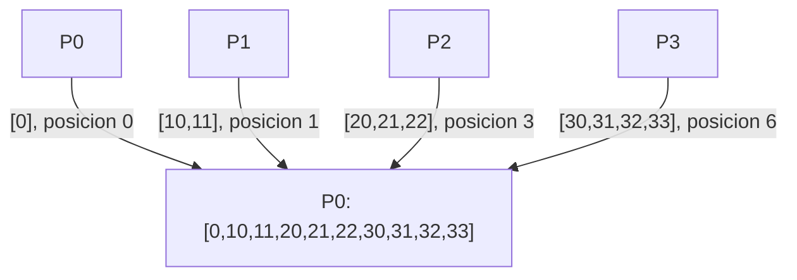

# MPI_Gatherv con Send y Recv

## Diagrama



## Funcionamiento

Pi envía n enteros. La raíz recibe counts[origen] enteros en datos + displs[origen] y copia localmente su aportación. Las cantidades y desplazamientos se utilizan en la raíz. En este ejemplo, n coincide con counts[rank].

**Ejemplo del diagrama:** P0 obtiene [0,10,11,20,21,22,30,31,32,33].

## Algoritmo y bloqueos

La raíz recibe de cada emisor, con el tamaño correspondiente. Los bloques de salida deben disponer de espacio y no solaparse.

Se usan mensajes bloqueantes, origen explícito y etiquetas reservadas. El algoritmo no depende de que MPI almacene los envíos en un búfer interno.

## Código con la colectiva original

Este bloque se coloca dentro de `main`, después de inicializar MPI y obtener `rank` y `size`. Usa los mismos datos y cuatro procesos que el ejemplo punto a punto. Es una alternativa al bloque de mensajes, no un bloque que se deba ejecutar junto a él.

```c
int n = rank + 1, local[4], datos[10];
int counts[4] = {1, 2, 3, 4}, displs[4] = {0, 1, 3, 6};
for (int i = 0; i < n; i++) local[i] = rank * 10 + i;
MPI_Gatherv(local, n, MPI_INT, datos, counts, displs, MPI_INT,
            0, MPI_COMM_WORLD);
if (rank == 0) {
    for (int i = 0; i < 10; i++) printf("%d ", datos[i]);
    printf("\n");
}
```

## Implementación punto a punto, paso a paso

La colectiva usa counts y displs para colocar bloques variables. En punto a punto, Pi envía n enteros y P0 recibe counts[i] en datos + displs[i]. Por ejemplo, los tres enteros de P2 empiezan en datos[3]. El bloque propio de P0 se copia localmente.

Los argumentos de cada mensaje son: dirección del búfer, cantidad de elementos, tipo (`MPI_INT`), destino en Send u origen en Recv, etiqueta y comunicador. Recv añade el argumento de estado; `MPI_STATUS_IGNORE` indica que no necesitamos consultarlo. El origen, destino, etiqueta y comunicador deben corresponder entre ambos mensajes.

## Código completo con MPI_Send y MPI_Recv

Programa independiente: [05_Gatherv.c](05_Gatherv.c). Toda la implementación está dentro de `main`, sin cabeceras propias ni funciones auxiliares ocultas.

```c
#include <mpi.h>
#include <stdio.h>

int main(int argc, char **argv) {
    MPI_Init(&argc, &argv);
    int rank, size;
    MPI_Comm_rank(MPI_COMM_WORLD, &rank);
    MPI_Comm_size(MPI_COMM_WORLD, &size);
    if (size != 4) {
        if (rank == 0) fprintf(stderr, "Ejecuta con 4 procesos.\n");
        MPI_Finalize();
        return 1;
    }

    int n = rank + 1, local[4], datos[10];
    int counts[4] = {1, 2, 3, 4};
    int displs[4] = {0, 1, 3, 6};
    const int etiqueta = 105;
    for (int i = 0; i < n; i++) local[i] = rank * 10 + i;
    
    if (rank == 0) {
        for (int i = 0; i < counts[0]; i++)
            datos[displs[0] + i] = local[i];
        for (int origen = 1; origen < size; origen++)
            MPI_Recv(datos + displs[origen], counts[origen], MPI_INT,
                     origen, etiqueta, MPI_COMM_WORLD, MPI_STATUS_IGNORE);
        for (int i = 0; i < 10; i++) printf("%d ", datos[i]);
        printf("\n");
    } else {
        MPI_Send(local, n, MPI_INT, 0, etiqueta, MPI_COMM_WORLD);
    }

    MPI_Finalize();
    return 0;
}
```

## Compilar y ejecutar

Desde esta carpeta, en un entorno con MPI instalado:

```bash
mpicc -std=c99 05_Gatherv.c -o 05_Gatherv
mpiexec -n 4 ./05_Gatherv
```

El orden de los printf de procesos distintos puede variar. Estos programas usan datos y tamaños preparados para exactamente cuatro procesos.

[Volver al índice](README.md)
