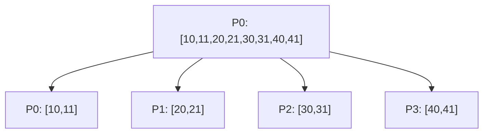

# MPI_Scatter con Send y Recv

## Diagrama



## Funcionamiento

La raíz manda cantidad enteros desde datos + destino * cantidad a cada destino. Copia su propio bloque directamente en local. Cada otro proceso recibe únicamente sus dos enteros.

**Ejemplo del diagrama:** P0 obtiene [10,11], P1 [20,21], P2 [30,31] y P3 [40,41].

## Algoritmo y bloqueos

Todos los procesos distintos de la raíz publican un Recv desde ella. La raíz envía a cada uno sin esperar aportaciones previas.

Se usan mensajes bloqueantes, origen explícito y etiquetas reservadas. El algoritmo no depende de que MPI almacene los envíos en un búfer interno.

## Código con la colectiva original

Este bloque se coloca dentro de `main`, después de inicializar MPI y obtener `rank` y `size`. Usa los mismos datos y cuatro procesos que el ejemplo punto a punto. Es una alternativa al bloque de mensajes, no un bloque que se deba ejecutar junto a él.

```c
int datos[8] = {10, 11, 20, 21, 30, 31, 40, 41}, local[2];
MPI_Scatter(datos, 2, MPI_INT, local, 2, MPI_INT, 0, MPI_COMM_WORLD);
printf("P%d: %d %d\n", rank, local[0], local[1]);
```

## Implementación punto a punto, paso a paso

La colectiva reparte dos enteros por proceso. En punto a punto, P0 manda desde datos + destino * 2. P2 recibe los elementos con índices 4 y 5: [30,31]. P0 copia los dos primeros a su bloque local.

Los argumentos de cada mensaje son: dirección del búfer, cantidad de elementos, tipo (`MPI_INT`), destino en Send u origen en Recv, etiqueta y comunicador. Recv añade el argumento de estado; `MPI_STATUS_IGNORE` indica que no necesitamos consultarlo. El origen, destino, etiqueta y comunicador deben corresponder entre ambos mensajes.

## Código completo con MPI_Send y MPI_Recv

Programa independiente: [06_Scatter.c](06_Scatter.c). Toda la implementación está dentro de `main`, sin cabeceras propias ni funciones auxiliares ocultas.

```c
#include <mpi.h>
#include <stdio.h>

int main(int argc, char **argv) {
    MPI_Init(&argc, &argv);
    int rank, size;
    MPI_Comm_rank(MPI_COMM_WORLD, &rank);
    MPI_Comm_size(MPI_COMM_WORLD, &size);
    if (size != 4) {
        if (rank == 0) fprintf(stderr, "Ejecuta con 4 procesos.\n");
        MPI_Finalize();
        return 1;
    }

    int datos[8] = {10, 11, 20, 21, 30, 31, 40, 41};
    int local[2];
    const int cantidad = 2, etiqueta = 106;
    
    if (rank == 0) {
        for (int i = 0; i < cantidad; i++) local[i] = datos[i];
        for (int destino = 1; destino < size; destino++)
            MPI_Send(datos + destino * cantidad, cantidad, MPI_INT,
                     destino, etiqueta, MPI_COMM_WORLD);
    } else {
        MPI_Recv(local, cantidad, MPI_INT, 0, etiqueta, MPI_COMM_WORLD,
                 MPI_STATUS_IGNORE);
    }
    printf("P%d: %d %d\n", rank, local[0], local[1]);

    MPI_Finalize();
    return 0;
}
```

## Compilar y ejecutar

Desde esta carpeta, en un entorno con MPI instalado:

```bash
mpicc -std=c99 06_Scatter.c -o 06_Scatter
mpiexec -n 4 ./06_Scatter
```

El orden de los printf de procesos distintos puede variar. Estos programas usan datos y tamaños preparados para exactamente cuatro procesos.

[Volver al índice](README.md)
