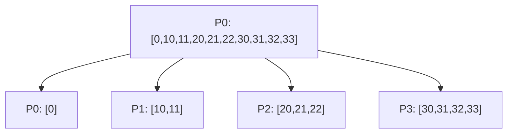

# MPI_Scatterv con Send y Recv

## Diagrama



## Funcionamiento

La raíz manda counts[destino] enteros desde datos + displs[destino]. Cada receptor utiliza capacidad n, igual a counts[rank] en este ejemplo. Las tablas se utilizan en la raíz y los desplazamientos se expresan en enteros. En punto a punto la capacidad de recepción también puede ser mayor, si el búfer tiene espacio.

**Ejemplo del diagrama:** Cada proceso obtiene el bloque indicado en el diagrama.

## Algoritmo y bloqueos

El tamaño de cada Recv debe corresponder al de su Send. No se mandan las tablas: el ejemplo ya conoce el tamaño local antes de recibir.

Se usan mensajes bloqueantes, origen explícito y etiquetas reservadas. El algoritmo no depende de que MPI almacene los envíos en un búfer interno.

## Código con la colectiva original

Este bloque se coloca dentro de `main`, después de inicializar MPI y obtener `rank` y `size`. Usa los mismos datos y cuatro procesos que el ejemplo punto a punto. Es una alternativa al bloque de mensajes, no un bloque que se deba ejecutar junto a él.

```c
int datos[10] = {0, 10, 11, 20, 21, 22, 30, 31, 32, 33};
int counts[4] = {1, 2, 3, 4}, displs[4] = {0, 1, 3, 6};
int n = rank + 1, local[4];
MPI_Scatterv(datos, counts, displs, MPI_INT, local, n, MPI_INT,
             0, MPI_COMM_WORLD);
printf("P%d:", rank);
for (int i = 0; i < n; i++) printf(" %d", local[i]);
printf("\n");
```

## Implementación punto a punto, paso a paso

La colectiva reparte tamaños variables. En punto a punto, P0 envía counts[i] enteros desde datos + displs[i]. Pi recibe n = rank + 1. Para P3, el envío comienza en índice 6 y tiene cuatro elementos. Las cantidades de Send y Recv deben coincidir.

Los argumentos de cada mensaje son: dirección del búfer, cantidad de elementos, tipo (`MPI_INT`), destino en Send u origen en Recv, etiqueta y comunicador. Recv añade el argumento de estado; `MPI_STATUS_IGNORE` indica que no necesitamos consultarlo. El origen, destino, etiqueta y comunicador deben corresponder entre ambos mensajes.

## Código completo con MPI_Send y MPI_Recv

Programa independiente: [07_Scatterv.c](07_Scatterv.c). Toda la implementación está dentro de `main`, sin cabeceras propias ni funciones auxiliares ocultas.

```c
#include <mpi.h>
#include <stdio.h>

int main(int argc, char **argv) {
    MPI_Init(&argc, &argv);
    int rank, size;
    MPI_Comm_rank(MPI_COMM_WORLD, &rank);
    MPI_Comm_size(MPI_COMM_WORLD, &size);
    if (size != 4) {
        if (rank == 0) fprintf(stderr, "Ejecuta con 4 procesos.\n");
        MPI_Finalize();
        return 1;
    }

    int datos[10] = {0, 10, 11, 20, 21, 22, 30, 31, 32, 33};
    int counts[4] = {1, 2, 3, 4}, displs[4] = {0, 1, 3, 6};
    int n = rank + 1, local[4];
    const int etiqueta = 107;
    
    if (rank == 0) {
        for (int i = 0; i < counts[0]; i++)
            local[i] = datos[displs[0] + i];
        for (int destino = 1; destino < size; destino++)
            MPI_Send(datos + displs[destino], counts[destino], MPI_INT,
                     destino, etiqueta, MPI_COMM_WORLD);
    } else {
        MPI_Recv(local, n, MPI_INT, 0, etiqueta, MPI_COMM_WORLD,
                 MPI_STATUS_IGNORE);
    }
    printf("P%d:", rank);
    for (int i = 0; i < n; i++) printf(" %d", local[i]);
    printf("\n");

    MPI_Finalize();
    return 0;
}
```

## Compilar y ejecutar

Desde esta carpeta, en un entorno con MPI instalado:

```bash
mpicc -std=c99 07_Scatterv.c -o 07_Scatterv
mpiexec -n 4 ./07_Scatterv
```

El orden de los printf de procesos distintos puede variar. Estos programas usan datos y tamaños preparados para exactamente cuatro procesos.

[Volver al índice](README.md)
