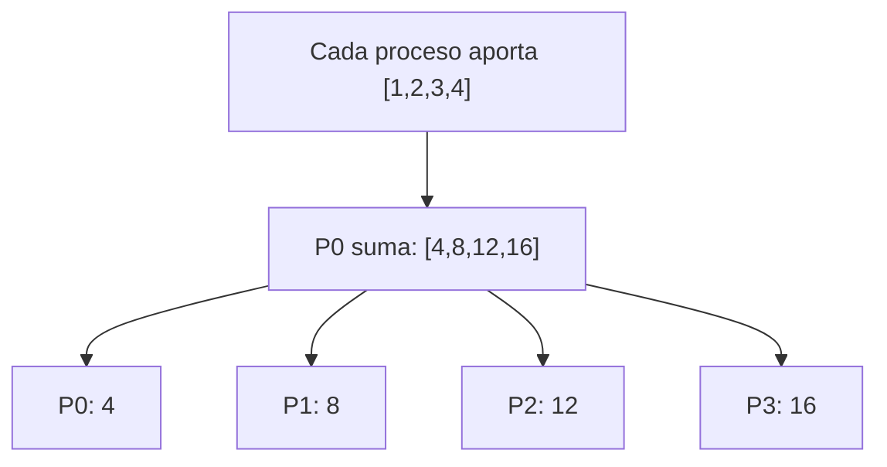

# MPI_Reduce_scatter con Send y Recv

## Diagrama



## Funcionamiento

Todos aportan un vector de sum(counts) elementos. P0 recoge y suma los vectores posición a posición. Después entrega bloques consecutivos del vector reducido: Pi recibe counts[i] elementos. P0 es un coordinador interno; no existe parámetro raíz. Todos deben usar la misma tabla.

**Ejemplo del diagrama:** P0 obtiene 4, P1 8, P2 12 y P3 16.

## Algoritmo y bloqueos

Los otros procesos envían su vector y después esperan su bloque. P0 recibe todos los vectores antes de iniciar el reparto; las dos fases usan etiquetas distintas.

Se usan mensajes bloqueantes, origen explícito y etiquetas reservadas. El algoritmo no depende de que MPI almacene los envíos en un búfer interno.

## Código con la colectiva original

Este bloque se coloca dentro de `main`, después de inicializar MPI y obtener `rank` y `size`. Usa los mismos datos y cuatro procesos que el ejemplo punto a punto. Es una alternativa al bloque de mensajes, no un bloque que se deba ejecutar junto a él.

```c
int entrada[4] = {1, 2, 3, 4}, local;
int counts[4] = {1, 1, 1, 1};
MPI_Reduce_scatter(entrada, &local, counts, MPI_INT, MPI_SUM,
                   MPI_COMM_WORLD);
printf("P%d: %d\n", rank, local);
```

## Implementación punto a punto, paso a paso

La colectiva reduce cuatro posiciones y reparte una a cada proceso. En punto a punto, todos envían el vector completo a P0; este calcula [4,8,12,16] sumando posición a posición. Después manda bloques consecutivos usando counts y un desplazamiento acumulado. Este ejemplo tiene un elemento por receptor; para bloques mayores habría que ampliar el búfer local.

Los argumentos de cada mensaje son: dirección del búfer, cantidad de elementos, tipo (`MPI_INT`), destino en Send u origen en Recv, etiqueta y comunicador. Recv añade el argumento de estado; `MPI_STATUS_IGNORE` indica que no necesitamos consultarlo. El origen, destino, etiqueta y comunicador deben corresponder entre ambos mensajes.

## Código completo con MPI_Send y MPI_Recv

Programa independiente: [08_Reduce_scatter.c](08_Reduce_scatter.c). Toda la implementación está dentro de `main`, sin cabeceras propias ni funciones auxiliares ocultas.

```c
#include <mpi.h>
#include <stdio.h>

int main(int argc, char **argv) {
    MPI_Init(&argc, &argv);
    int rank, size;
    MPI_Comm_rank(MPI_COMM_WORLD, &rank);
    MPI_Comm_size(MPI_COMM_WORLD, &size);
    if (size != 4) {
        if (rank == 0) fprintf(stderr, "Ejecuta con 4 procesos.\n");
        MPI_Finalize();
        return 1;
    }

    int entrada[4] = {1, 2, 3, 4}, local;
    int counts[4] = {1, 1, 1, 1};
    const int llegada = 108, reparto = 109;
    /* Todos aportan sum(counts) = 4 elementos. */
    const int longitud = 4;
    
    if (rank == 0) {
        int suma[4], recibido[4];
        for (int i = 0; i < longitud; i++) suma[i] = entrada[i];
        /* Fase 1: sumar los vectores elemento a elemento. */
        for (int origen = 1; origen < size; origen++) {
            MPI_Recv(recibido, longitud, MPI_INT, origen, llegada,
                     MPI_COMM_WORLD, MPI_STATUS_IGNORE);
            for (int i = 0; i < longitud; i++) suma[i] += recibido[i];
        }
        /* Fase 2: repartir bloques consecutivos del vector suma. */
        local = suma[0];
        int desplazamiento = counts[0];
        for (int destino = 1; destino < size; destino++) {
            MPI_Send(suma + desplazamiento, counts[destino], MPI_INT,
                     destino, reparto, MPI_COMM_WORLD);
            desplazamiento += counts[destino];
        }
    } else {
        MPI_Send(entrada, longitud, MPI_INT, 0, llegada, MPI_COMM_WORLD);
        MPI_Recv(&local, counts[rank], MPI_INT, 0, reparto,
                 MPI_COMM_WORLD, MPI_STATUS_IGNORE);
    }
    printf("P%d: %d\n", rank, local);

    MPI_Finalize();
    return 0;
}
```

## Compilar y ejecutar

Desde esta carpeta, en un entorno con MPI instalado:

```bash
mpicc -std=c99 08_Reduce_scatter.c -o 08_Reduce_scatter
mpiexec -n 4 ./08_Reduce_scatter
```

El orden de los printf de procesos distintos puede variar. Estos programas usan datos y tamaños preparados para exactamente cuatro procesos.

[Volver al índice](README.md)
