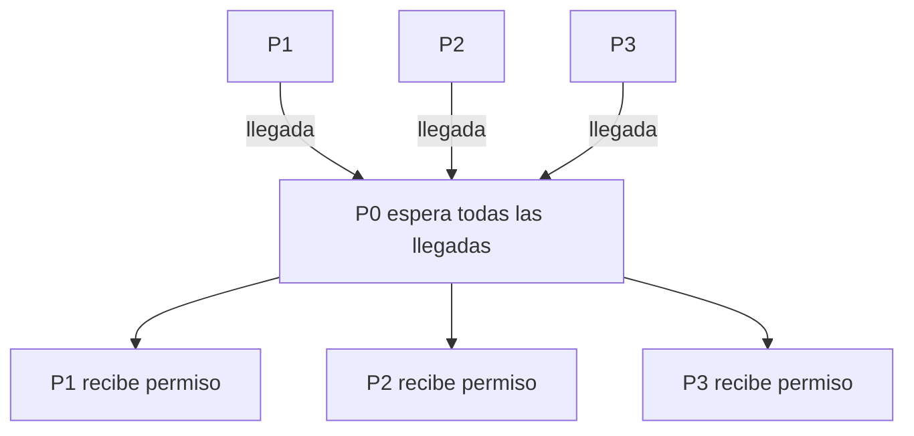

# MPI_Barrier con Send y Recv

## Diagrama



## Funcionamiento

Cada proceso distinto de P0 manda una señal de llegada y espera un permiso. P0 recoge todas las señales antes de enviar los permisos. Por tanto nadie puede terminar la barrera antes de que todos hayan entrado. Recoger solo las señales no bastaría: los emisores podrían seguir demasiado pronto.

**Ejemplo del diagrama:** Todos ejecutan el segundo printf después de que todos hayan entrado en la fase de sincronización. La consola puede mostrar las líneas en otro orden por su gestión de salida.

## Algoritmo y bloqueos

Las señales de llegada y los permisos usan etiquetas distintas. P0 no envía permisos hasta completar todas las recepciones. No se exige que todos salgan simultáneamente.

Se usan mensajes bloqueantes, origen explícito y etiquetas reservadas. El algoritmo no depende de que MPI almacene los envíos en un búfer interno.

## Código con la colectiva original

Este bloque se coloca dentro de `main`, después de inicializar MPI y obtener `rank` y `size`. Usa los mismos datos y cuatro procesos que el ejemplo punto a punto. Es una alternativa al bloque de mensajes, no un bloque que se deba ejecutar junto a él.

```c
printf("P%d antes\n", rank);
MPI_Barrier(MPI_COMM_WORLD);
printf("P%d despues\n", rank);
```

## Implementación punto a punto, paso a paso

La colectiva espera a que todos hayan entrado. En punto a punto hay dos fases: cada otro proceso envía una señal de llegada y espera un permiso; P0 recibe todas las llegadas antes de enviar permisos. Si se eliminase el Recv del permiso, los emisores podrían continuar demasiado pronto.

Los argumentos de cada mensaje son: dirección del búfer, cantidad de elementos, tipo (`MPI_INT`), destino en Send u origen en Recv, etiqueta y comunicador. Recv añade el argumento de estado; `MPI_STATUS_IGNORE` indica que no necesitamos consultarlo. El origen, destino, etiqueta y comunicador deben corresponder entre ambos mensajes.

## Código completo con MPI_Send y MPI_Recv

Programa independiente: [09_Barrier.c](09_Barrier.c). Toda la implementación está dentro de `main`, sin cabeceras propias ni funciones auxiliares ocultas.

```c
#include <mpi.h>
#include <stdio.h>

int main(int argc, char **argv) {
    MPI_Init(&argc, &argv);
    int rank, size;
    MPI_Comm_rank(MPI_COMM_WORLD, &rank);
    MPI_Comm_size(MPI_COMM_WORLD, &size);
    if (size != 4) {
        if (rank == 0) fprintf(stderr, "Ejecuta con 4 procesos.\n");
        MPI_Finalize();
        return 1;
    }

    int token = 1;
    const int llegada = 110, permiso = 111;
    printf("P%d antes\n", rank);
    
    if (rank == 0) {
        /* Nadie recibe permiso hasta que todos hayan llegado. */
        for (int origen = 1; origen < size; origen++)
            MPI_Recv(&token, 1, MPI_INT, origen, llegada,
                     MPI_COMM_WORLD, MPI_STATUS_IGNORE);
        for (int destino = 1; destino < size; destino++)
            MPI_Send(&token, 1, MPI_INT, destino, permiso, MPI_COMM_WORLD);
    } else {
        MPI_Send(&token, 1, MPI_INT, 0, llegada, MPI_COMM_WORLD);
        MPI_Recv(&token, 1, MPI_INT, 0, permiso, MPI_COMM_WORLD,
                 MPI_STATUS_IGNORE);
    }
    printf("P%d despues\n", rank);

    MPI_Finalize();
    return 0;
}
```

## Compilar y ejecutar

Desde esta carpeta, en un entorno con MPI instalado:

```bash
mpicc -std=c99 09_Barrier.c -o 09_Barrier
mpiexec -n 4 ./09_Barrier
```

El orden de los printf de procesos distintos puede variar. Estos programas usan datos y tamaños preparados para exactamente cuatro procesos.

[Volver al índice](README.md)
