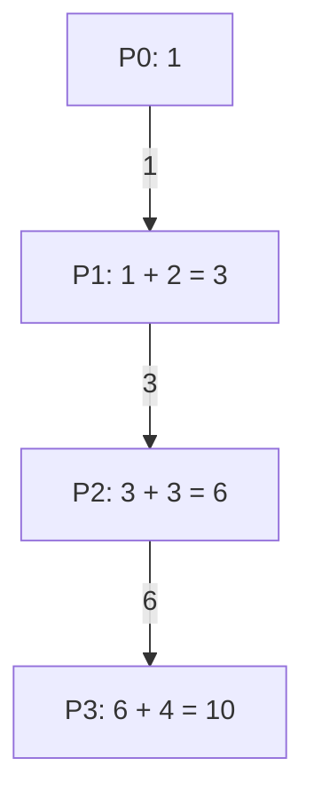

# MPI_Scan con Send y Recv

## Diagrama



## Funcionamiento

P0 comienza con su aportación y la manda a P1. Cada Pi recibe el prefijo anterior, añade su valor y manda el nuevo prefijo a Pi+1. El último no envía. Este programa calcula prefijos escalares; MPI_Scan también admite vectores, cuya implementación manual requeriría combinar cada posición.

**Ejemplo del diagrama:** P0 obtiene 1, P1 3, P2 6 y P3 10.

## Algoritmo y bloqueos

P0 inicia la cadena sin recibir. Los demás reciben antes de enviar: no hay un ciclo de procesos esperando.

Se usan mensajes bloqueantes, origen explícito y etiquetas reservadas. El algoritmo no depende de que MPI almacene los envíos en un búfer interno.

## Código con la colectiva original

Este bloque se coloca dentro de `main`, después de inicializar MPI y obtener `rank` y `size`. Usa los mismos datos y cuatro procesos que el ejemplo punto a punto. Es una alternativa al bloque de mensajes, no un bloque que se deba ejecutar junto a él.

```c
int local = rank + 1, prefijo;
MPI_Scan(&local, &prefijo, 1, MPI_INT, MPI_SUM, MPI_COMM_WORLD);
printf("P%d: %d\n", rank, prefijo);
```

## Implementación punto a punto, paso a paso

La colectiva calcula prefijos inclusivos. En punto a punto, P0 inicia la cadena con 1. P1 recibe 1, suma 2 y envía 3; P2 recibe 3, suma 3 y envía 6; P3 recibe 6 y suma 4 para obtener 10. El último no envía.

Los argumentos de cada mensaje son: dirección del búfer, cantidad de elementos, tipo (`MPI_INT`), destino en Send u origen en Recv, etiqueta y comunicador. Recv añade el argumento de estado; `MPI_STATUS_IGNORE` indica que no necesitamos consultarlo. El origen, destino, etiqueta y comunicador deben corresponder entre ambos mensajes.

## Código completo con MPI_Send y MPI_Recv

Programa independiente: [10_Scan.c](10_Scan.c). Toda la implementación está dentro de `main`, sin cabeceras propias ni funciones auxiliares ocultas.

```c
#include <mpi.h>
#include <stdio.h>

int main(int argc, char **argv) {
    MPI_Init(&argc, &argv);
    int rank, size;
    MPI_Comm_rank(MPI_COMM_WORLD, &rank);
    MPI_Comm_size(MPI_COMM_WORLD, &size);
    if (size != 4) {
        if (rank == 0) fprintf(stderr, "Ejecuta con 4 procesos.\n");
        MPI_Finalize();
        return 1;
    }

    int local = rank + 1, prefijo;
    const int etiqueta = 112;
    
    if (rank == 0) {
        prefijo = local; /* P0 inicia la cadena. */
    } else {
        MPI_Recv(&prefijo, 1, MPI_INT, rank - 1, etiqueta,
                 MPI_COMM_WORLD, MPI_STATUS_IGNORE);
        prefijo += local;
    }
    if (rank + 1 < size)
        MPI_Send(&prefijo, 1, MPI_INT, rank + 1, etiqueta, MPI_COMM_WORLD);
    printf("P%d: %d\n", rank, prefijo);

    MPI_Finalize();
    return 0;
}
```

## Compilar y ejecutar

Desde esta carpeta, en un entorno con MPI instalado:

```bash
mpicc -std=c99 10_Scan.c -o 10_Scan
mpiexec -n 4 ./10_Scan
```

El orden de los printf de procesos distintos puede variar. Estos programas usan datos y tamaños preparados para exactamente cuatro procesos.

[Volver al índice](README.md)
