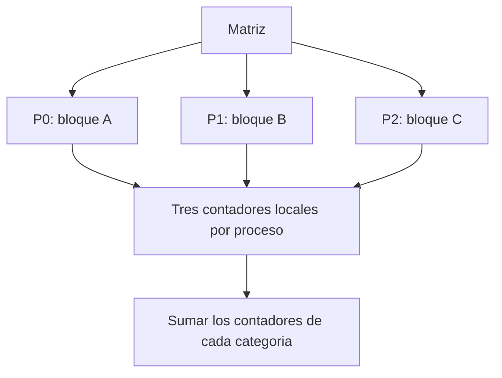
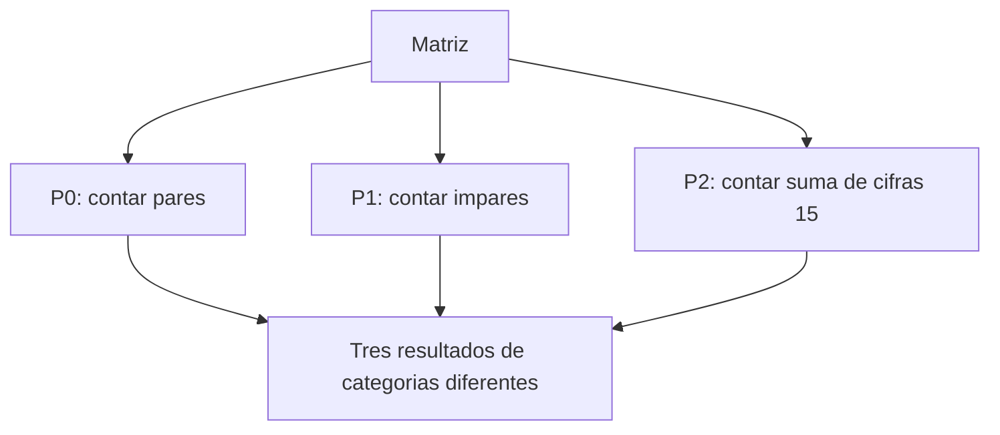

# Repartir trabajo: dominio y funciones

Queremos recorrer una matriz para contar elementos pares, elementos impares y números cuyas cifras suman 15. Podemos repartir los datos o repartir las operaciones.

## Descomposición de dominio

Cada proceso recibe una parte de la matriz y realiza las mismas tres operaciones sobre su bloque.

Al final se suman por separado los contadores de pares, impares y suma de cifras 15. Las categorías no tienen por qué ser excluyentes: un número puede ser impar y, además, tener suma de cifras 15.

Este modelo puede implementarse con MPI o con hilos de memoria compartida. No es exclusivo de MPI.

**Balanceo:** tener la misma cantidad de elementos da cargas parecidas solo si el coste de procesarlos es parecido y los recursos son comparables. Calcular la suma de cifras puede requerir más trabajo para números con más dígitos. Hay que considerar también comunicaciones y sincronización.

## Descomposición funcional

Cada trabajador ejecuta una operación distinta sobre los datos que necesita:

Con procesos MPI, si todos necesitan la matriz completa, habrá que proporcionarles esos datos; con hilos pueden consultar una matriz compartida.

Asignar una función fija a cada uno de tres procesos limita ese reparto concreto a tres tareas y puede crear desequilibrio si una función tarda más. No significa que toda descomposición funcional carezca de escalabilidad: se puede combinar con reparto por dominio o diseñar otras tareas.

## Cómo elegir

Compara el número de tareas disponibles, el coste de cada operación, las dependencias, la memoria y la cantidad de datos que hay que comunicar. Primero verifica una versión secuencial y después comprueba que los contadores paralelos coinciden.

[Ejemplo de reparto en MPI](15_septiembre.md#ejemplo-contar-elementos-pares).
