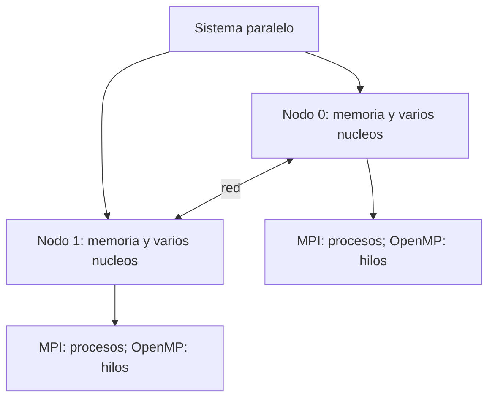
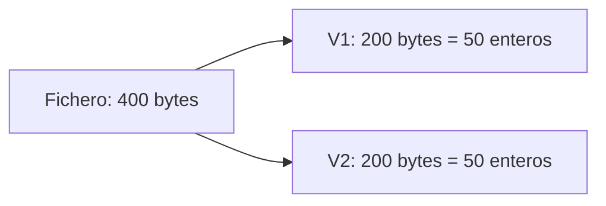

# Clase del 8 de septiembre: introducción y práctica P0_T1

Estas notas recogen la introducción a la asignatura y las preguntas sobre el fichero binario de P0_T1. Las aclaraciones distinguen las anotaciones de clase de las propiedades generales de C.

## Objetivos anotados

1. Evaluar las prestaciones de un sistema paralelo considerando hardware y software.
2. Diseñar algoritmos paralelos y paralelizar programas secuenciales.
3. Programar memoria distribuida con MPI.
4. Programar memoria compartida con OpenMP.
5. Conocer las arquitecturas y el paradigma CUDA para GPU.

Estos son los objetivos registrados en las notas; el repositorio desarrolla sobre todo C secuencial, MPI y OpenMP y no contiene un bloque de ejercicios CUDA.

## Arquitecturas y herramientas

Un clúster es un conjunto de computadores conectados por una red. Sus nodos pueden tener varios núcleos, y cada núcleo constituye un recurso de procesamiento, aunque comparta parte de la memoria y las cachés del chip.



MPI permite distribuir trabajo y comunicar procesos, incluidos procesos en un mismo equipo. OpenMP permite repartir trabajo entre hilos con memoria compartida. Las arquitecturas híbridas combinan ambos niveles; las GPU ofrecen otra clase de recursos.

## Evaluación registrada en clase

La anotación original indica un examen final escrito con peso del 100 % y duración aproximada entre 2 h 30 min y 3 h. Esta nota refleja lo registrado ese día; no sustituye a la guía docente ni a las indicaciones posteriores del profesorado. No se debe trasladar automáticamente un criterio de evaluación de otro curso.

## P0_T1: dos vectores en 400 bytes

### Diagrama del fichero

Si el fichero contiene exclusivamente dos vectores iguales de enteros y cada entero del formato ocupa cuatro bytes:



Son **100 enteros en total**, no 200 enteros por vector. La cifra de 200 es el número de bytes correspondiente a cada vector. Comprueba sizeof(int) y que coincida con el formato del fichero; C no exige que int mida siempre cuatro bytes.

### Preguntas y respuestas

**¿Qué tamaño tendría un fichero de texto equivalente?**

No puede determinarse solo a partir del tamaño binario. Depende de los valores, número de dígitos, signos y separadores de la representación elegida.

**¿Podemos conocer cuántos enteros contiene un texto de 400 bytes mirando solo su tamaño?**

No. Dos textos del mismo tamaño pueden representar cantidades diferentes de números. Hay que analizar el contenido y su formato. Saber que usa signos y separadores no permite calcular la cantidad únicamente con los bytes totales.

**¿Cómo sabemos cuántos elementos leer?**

El tamaño y distribución deben venir del enunciado, los argumentos, metadatos del fichero o el análisis de su contenido. El programa debe comprobar que la lectura y la reserva son compatibles con el fichero, y verificar el retorno de fread.

Si el fichero almacena dos vectores completos de cincuenta enteros y solo se quieren los primeros diez de cada uno, después de leer diez de V1 no se está aún al principio de V2: faltan cuarenta enteros de V1 que hay que saltar o leer.

**¿Cuándo utilizar memoria dinámica?**

Cuando el tamaño se decide durante la ejecución y necesitamos controlar la reserva o su duración. No es automáticamente la mejor opción para todos los tamaños; un array automático también puede servir para un ejemplo pequeño.

**¿Qué diferencia hay entre int v[tam] y malloc?**

```c
int v[tam]; /* Array de longitud variable, si lo admite el compilador. */
```

Tiene duración automática y termina al salir de su bloque. No es una reserva de duración estática.

```c
int *v = malloc((size_t)tam * sizeof *v);
/* Comprobar v != NULL antes de usarlo. */
free(v);
```

malloc proporciona almacenamiento dinámico hasta que se libera. Necesita stdlib.h, un tamaño válido y comprobación del resultado. Su soporte no depende de los arrays de longitud variable.

## Bibliografía anotada

- Introducción a la programación paralela: Francisco Almeida Rodríguez, Domingo Giménez Cánovas, José Miguel Mantas Ruiz y Antonio Vidal Maciá.
- Using MPI: William Gropp, Ewing Lusk y Anthony Skjellum.
- Using OpenMP: Barbara Chapman, Gabriele Jost y Ruud van der Pas.
- CUDA by Example: Jason Sanders y Edward Kandrot.
- Fundamentos de los computadores: Pedro de Miguel Anasagasti.
- Estructura de computadores: José María Angulo Usategui, Paraninfo, 1996, según la anotación original; confirmar la edición docente.
- Arquitectura de computadores: Julio Ortega Lopera, Alberto Prieto Espinosa y Mancia Anguita López, Thomson, según la anotación original; confirmar la edición docente.
- Organización y arquitectura de computadores: William Stallings.

Recursos oficiales: [MPI Forum](https://www.mpi-forum.org/), [OpenMP](https://www.openmp.org/) y [CUDA](https://developer.nvidia.com/cuda-zone). Para nombres y ediciones concretas, utiliza la bibliografía docente.

[Práctica P0_T1](../../Practica/Secuencial/P0-1/README.md) · [Clase del 11 de septiembre revisada](11_septiembre_revisado.md).
