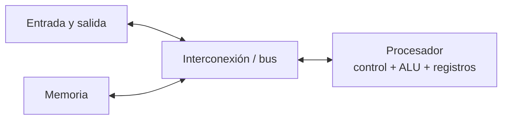

# Fundamentos de arquitectura y paralelismo

## 1. Para qué paralelizamos

La meta habitual es reducir el tiempo de ejecución repartiendo trabajo entre varios recursos de cómputo. El código paralelo debe producir un resultado correcto y equivalente al del programa secuencial de referencia.

El rendimiento depende del conjunto completo: algoritmo, programa, compilador, procesadores, memoria, red y forma de lanzar el trabajo. Añadir procesadores por sí solo no garantiza acelerar una aplicación.

## 2. Arquitectura básica

En el modelo clásico de von Neumann encontramos procesador, memoria, entrada/salida y las vías que los conectan. Dentro del procesador hay unidades de control, unidades aritmético-lógicas y registros.



Una arquitectura paralela dispone de varios elementos de procesamiento capaces de ejecutar trabajo simultáneamente. Hay sistemas con varios núcleos en un nodo, varios nodos conectados por red y sistemas híbridos que combinan ambas cosas.

## 3. Concurrencia, paralelismo y segmentación

- **Concurrencia:** varias tareas progresan durante periodos que se solapan. En un único núcleo, el sistema puede alternarlas.
- **Paralelismo:** varias tareas se ejecutan al mismo tiempo en elementos de procesamiento diferentes.
- **Multitarea:** el sistema operativo reparte tiempo y recursos entre procesos; no implica que dos instrucciones se ejecuten simultáneamente.
- **Segmentación (pipeline):** distintas fases de instrucciones diferentes se solapan dentro del procesador. Mejora el rendimiento sostenido, pero no significa que toda instrucción individual tarde menos ni que siempre se completen varias instrucciones por ciclo.

## 4. Medidas de rendimiento

Se compara la versión paralela con una versión secuencial correcta, usando el mismo problema y condiciones comparables.

| Medida | Fórmula | Lectura |
|---|---|---|
| Aceleración (speed-up) | `S(P) = T(1) / T(P)` | Cuántas veces reduce el tiempo usar `P` procesos o procesadores. |
| Eficiencia | `E(P) = S(P) / P` | Fracción media de uso efectivo de los `P` recursos. |
| Escalabilidad | Se estudia al variar problema y recursos | Describe cómo cambia el rendimiento; no es un único número universal. |

`T(1)` es el tiempo secuencial y `T(P)` el tiempo con `P` recursos. Si `S(P) = P`, la aceleración es ideal y la eficiencia vale 1. Comunicación, sincronización, desequilibrio y partes secuenciales reducen la ganancia.

### Ley de Amdahl

Si `f` es la fracción paralelizable del trabajo y `1-f` queda secuencial, una cota ideal es:

```text
S(P) = 1 / ((1 - f) + f/P)
```

Cuando `P` crece mucho, el límite es `1/(1-f)`. Por eso conviene reducir también el trabajo secuencial y el coste de coordinación.

## 5. Memoria compartida y distribuida

En **memoria compartida**, los hilos pueden acceder al mismo espacio de direcciones. En **memoria distribuida**, cada proceso tiene memoria propia y los datos se intercambian mediante comunicaciones. Un clúster une nodos por una red y suele combinar varios núcleos dentro de cada nodo.

MPI está diseñado para el paso de mensajes y se usa principalmente para memoria distribuida. Puede ejecutarse también en un solo equipo. OpenMP se usa para paralelismo de memoria compartida; CUDA permite programar GPUs.

## 6. Diseño antes de codificar

Antes de escribir comunicaciones, concreta:

1. Qué trabajo hace el programa secuencial y cuál es su resultado de referencia.
2. Cómo se divide el dominio de datos.
3. Qué proceso obtiene y distribuye los datos.
4. Qué comunicación necesita cada parte y cuándo se sincroniza.
5. Cómo se combinan los resultados parciales.
6. Qué memoria necesita cada proceso y cómo se mide el rendimiento.

El **reparto por dominio** aplica la misma operación a partes diferentes de los datos. El **reparto funcional** asigna operaciones distintas a recursos distintos. Bloques por filas o columnas y reparto cíclico son estrategias de dominio; la mejor depende del coste y la forma de los datos.
