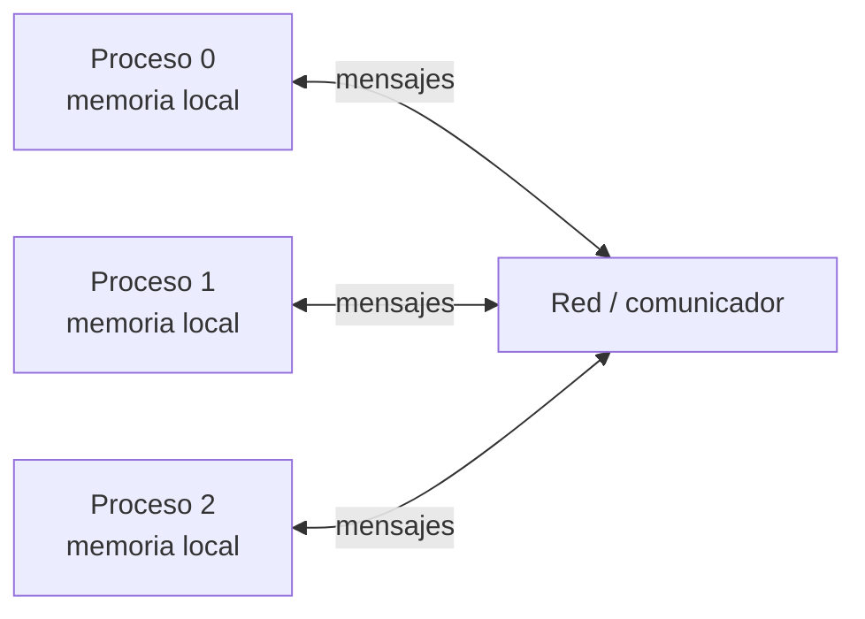

# MPI y memoria distribuida

## 1. Modelo de procesos

MPI (Message Passing Interface) es una interfaz estándar para que procesos intercambien datos. En el modelo de memoria distribuida, cada proceso tiene su propio espacio de direcciones: una variable llamada `v` en dos procesos no es una variable compartida.



Se suele compilar un ejecutable y lanzarlo en varios procesos. El código es el mismo; condiciones según `rank` hacen que los procesos ejecuten partes distintas. Cada proceso tiene sus propias variables y debe recibir explícitamente los datos que necesita.

## 2. Inicialización, rango y tamaño

```c
#include <mpi.h>

int main(int argc, char *argv[]) {
    int rank, nproces;
    MPI_Init(&argc, &argv);
    MPI_Comm_size(MPI_COMM_WORLD, &nproces);
    MPI_Comm_rank(MPI_COMM_WORLD, &rank);
    /* trabajo MPI */
    MPI_Finalize();
}
```

- `MPI_Init` inicia el entorno MPI y se llama antes de las demás funciones MPI.
- `MPI_COMM_WORLD` es el comunicador predefinido del grupo de procesos lanzados.
- `MPI_Comm_size` devuelve cuántos procesos pertenecen al comunicador.
- `MPI_Comm_rank` devuelve el identificador local del proceso, de `0` a `nproces-1`.
- `MPI_Finalize` cierra el entorno MPI; todos los procesos deben completar su uso de MPI antes de finalizar.

Las salidas de `printf` de varios procesos pueden mezclarse y su orden puede cambiar entre ejecuciones. Incluye `rank` en mensajes de depuración.

## 3. Mensajes: `MPI_Send` y `MPI_Recv`

Un mensaje describe una secuencia contigua de elementos en memoria. El emisor especifica la dirección inicial, el número y tipo de elementos, destino, etiqueta y comunicador.

```c
MPI_Send(buffer, cantidad, tipo_mpi, destino, tag, comunicador);
MPI_Recv(buffer, capacidad, tipo_mpi, origen, tag, comunicador, &status);
```

La recepción debe coincidir en proceso emisor/destinatario, tipo, cantidad compatible, etiqueta y comunicador. El búfer receptor debe tener espacio suficiente. `MPI_Recv` es bloqueante: no termina hasta recibir un mensaje compatible. Un origen o etiqueta comodín se pueden expresar con `MPI_ANY_SOURCE` o `MPI_ANY_TAG` en recepción.

El envío bloqueante no significa necesariamente que el receptor ya haya procesado el mensaje cuando retorna. Evita depender de detalles de buffers; diseña las parejas de envío y recepción y comprueba que no haya esperas circulares.

Para enviar un vector contiguo:

```c
MPI_Send(vector, n, MPI_INT, destino, tag, MPI_COMM_WORLD);
MPI_Recv(vector, n, MPI_INT, origen, tag, MPI_COMM_WORLD, &status);
```

La nomenclatura de tipos MPI debe corresponder a la implementación y al lenguaje. En C se emplean tipos como `MPI_INT`, `MPI_DOUBLE` y `MPI_CHAR`.

## 4. Comunicaciones colectivas

Las operaciones colectivas involucran a todos los procesos del comunicador participante y se deben llamar en un orden compatible.

### Broadcast

```c
MPI_Bcast(buffer, cantidad, tipo, raiz, comunicador);
```

La raíz distribuye el contenido a todos los miembros del comunicador. La raíz también llama a `MPI_Bcast`. Si se debe enviar solo a ciertos procesos, puede usarse envío/recepción punto a punto o un comunicador de ese grupo.

### Reduce

```c
MPI_Reduce(entrada, resultado, cantidad, tipo, operacion, raiz, comunicador);
```

Combina los valores aportados por todos los procesos mediante una operación, por ejemplo suma o máximo, y deja el resultado en la raíz. También puede reducir elemento a elemento vectores del mismo tamaño.

### Allreduce

```c
MPI_Allreduce(entrada, resultado, cantidad, tipo, operacion, comunicador);
```

Realiza la reducción y entrega el resultado a todos los procesos; equivale conceptualmente a reducir y después difundir el resultado.

## 5. Reparto del trabajo

Para contar pares de una matriz, por ejemplo, se puede dividir la matriz en bloques y asignar una parte a cada proceso. Cada uno calcula un resultado parcial, y después los resultados parciales se combinan.

```text
Proceso 0: bloque A ──> parcial 0 ─┐
Proceso 1: bloque B ──> parcial 1 ─┼──> reducción ──> resultado
Proceso 2: bloque C ──> parcial 2 ─┘
```

En descomposición de dominio, todos hacen la misma operación sobre porciones distintas. En descomposición funcional, los procesos hacen operaciones diferentes. El reparto por bloques de filas, columnas o de forma cíclica son opciones; hay que equilibrar carga y coste de comunicación.

## 6. Método para pasar de secuencial a MPI

1. Completa y valida el algoritmo secuencial.
2. Determina qué datos necesita cada proceso.
3. Decide cómo repartirlos y quién lee o distribuye la entrada.
4. Dibuja el patrón de comunicaciones: origen, destino, contenido y momento.
5. Reserva memoria en cada proceso según sus datos locales y resultados.
6. Programa y prueba varios tamaños de problema y de procesos.
7. Compara el resultado paralelo con la referencia secuencial.
8. Mide tiempo, aceleración y eficiencia; separa cómputo y comunicación cuando sea útil.

El proceso 0 suele coordinar la entrada y el resultado en ejemplos sencillos, pero no es una regla universal. La elección forma parte del diseño.

## 7. Esquema de emparejamiento de mensajes

Antes de codificar, crea una tabla:

| Envío | Recepción compatible |
|---|---|
| Emisor `rank = a` | Origen `a` o `MPI_ANY_SOURCE` |
| Destino `b` | Proceso que ejecuta la recepción |
| Mismo `tag` | Mismo `tag` o `MPI_ANY_TAG` |
| Cantidad y tipo | Capacidad suficiente y tipo compatible |
| Mismo comunicador | Mismo comunicador |

Si `Recv` espera un emisor, etiqueta o comunicador que nunca llega, el proceso puede quedarse bloqueado. Una coincidencia superficial de etiquetas no basta: emisor, receptor, tipo y comunicador también deben encajar.
